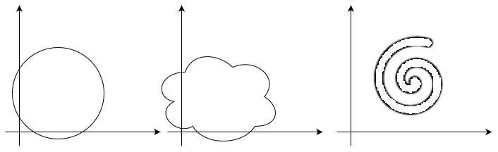
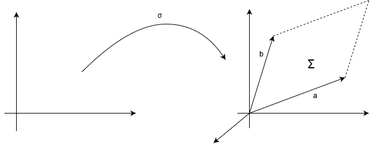
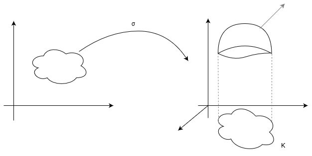

# Analisi II - ottava parte
### Curve equivalenti
Siano $γ_1:I_1\to \mathbb{R}^n$ e $γ_2:I_2\to \mathbb{R}^n$. Si dice che $γ_1$ e $γ_2$ sono equivalenti se esiste $h:I_2\to I_1$ t.c.
1. $h$ è biiettiva
2. $h$ è di classe $C^1$ con $h'(s)\neq 0$ in $I_2$, ovvero $h$ è solo crescente o decrescente
3. $γ_1(h(s))=γ_2(s)$, $\forall s\in I_2$
### Osservazione
Se $γ_1$ e $γ_2$ sono equivalenti allora $sost(γ_1)=sost(γ_2)$
### Orientazione di una curva
Siano $γ_1$ e $γ_2$ due curve equivalenti.
Si dice che $γ_1$ e $γ_2$ hanno la stessa orientazione/sono equiverse se $h'(s)>0$ $\forall s\in I_2$ e si scrive $γ_1\simγ_2$
Si dice che $γ_1$ e $γ_2$ hanno orientazione opposte se $h'(s)<0$ $\forall s\in I_2$ e si scrive $γ_1\sim-γ_2$
### Osservazione
Siano $γ_1,γ_2$ due curve __regolari__ ($γ'_1(t)\neq 0$ e $γ'_2(t)\neq 0$, $\forall t$) equivalenti. Si ha:
+ se $γ_1$ e $γ_2$ hanno la stessa orientazione, allora $τ_1(h(s))=τ_2(s)$ in $I_2$
+ altrimenti ($γ_1\sim -γ_2$), allora  $τ_1(h(s))=-τ_2(s)$ in $I_2$
Infatti:
$τ_2(s)=\displaystyle \frac{γ'_2(s)}{||γ'_2(s)||}=\frac{\frac{d}{ds}γ_1(h(s))}{||\frac{d}{ds}γ_1(h(s))||}=\frac{γ'_1(h(s))\cdot h'(s)}{||γ'_1(h(s))\cdot h'(s)||}=\frac{γ'_1(h(s))\cdot h'(s)}{||γ'_1(h(s))\cdot h'(s)||}=\begin{cases}τ_1(h(s))\text{ se }γ_1\sim γ_2\\-τ_1(h(s))\text{ se }γ_1\sim -γ_2\end{cases}$
### Integrazione su curve
#### Integrazione di linea di un campo scalare
Siano $γ:I=[a,b]\to \mathbb{R}^n$ una curva regolare e $f:E(\subseteq \mathbb{R}^n)\to \mathbb{R}$ un campo scalare (---...?---)
Si definisce integrale di $f$ su $γ$ $\int_γfds=\int_a^bf(γ(t))||γ'(t)||dt$
#### Osservazione
Se $f=1$ in $E$ allora $\int_γ1ds=\int_a^b||γ'(t)||dt=l(γ)$
#### Proposizione
Se $γ_1$ e $γ_2$ sono curve regolari equivalenti e $f$ è un campo scalare continuo $\int_{γ_1}fds=\int_{γ_2}fds$
(si verifica tramite la funzione $h:I_2\to I_1$ e cambio di variabile integrazione unidimensionale)
#### Integrali di linea di campi vettoriali
Siano $γ:I=[a,b]\to \mathbb{R}^n$ una curva regolare e $g:E(\subseteq \mathbb{R}^n)\to \mathbb{R}^n$ un campo vettoriale continuo, con $γ(I)\subseteq E$. Si definisce integrale di linea di $g$ su $γ$ $\int_γ<g,τ>ds=\int_a^b<g(γ(t)),γ'(t)>dt$
#### Osservazione
$\displaystyle \int_a^b<g(γ(t)),γ'(t)>dt)=\int_a^b<g(γ(t)),\underbrace{\frac{γ'(t)}{||γ'(t)||}}_{τ(t)}>\cdot ||γ'(t)||dt=\int_a^b<g(γ(t)),τ(t)>||γ'(t)||dt=\int_γ<g,τ>dt$
#### Proposizione
Se $γ_1$ e $γ_2$ sono curve regolari equivalenti con la stessa orientazione, allora $\displaystyle \int_{γ_1}<g,τ>ds=\int_{γ_2}<g,τ>ds$
Se $γ_1$ e $γ_2$ sono curve regolari equivalenti con orientazione opposta, allora $\displaystyle \int_{γ_1}<g,τ>ds=-\int_{γ_2}<g,τ>ds$
#### Intepretazione fisica
Sia $g$ un campo di forze: $\int_γ<g,τ>ds$ è il lavoro che il campo $g$ compie per portare un punto dalla posizione $γ(a)$ alla posizione $γ(b)$ lungo il percorso $γ$
##### Notazione
+ $N=2$, $g(x,y)=(X(x,y), Y(x,y))^T$ e $γ(t)=(x(t),y(t))^T$
$\displaystyle \int_γ<g,τ>ds=\int_a^b<g(γ(t)),γ'(t)>dt=\int_a^b(X(γ(t))x'(t)+Y(γ(t))y'(t))dt=$
$=\int_γXdx+Ydy\to$ forma differenziale $\left(\begin{aligned} x(t)dt=dx \\ y(t)dt=dy\end{aligned}\right)$
+ $N=3$, $g(x,y,z)=(X(z,y,z)+Y(z,y,z)+Z(z,y,z))^T$
$γ(t)=(x(t),y(t),z(t))^T$
$\displaystyle \int_γ<g,τ>ds=\int_a^b<g(γ(t)),γ'(t)>dt=\int_a^b<g(γ(t)),γ'(t)>dt=\int_a^b(X(γ(t)x'(t)+Y(γ(t))y'(t)+Z(γ(t))z'(t))dt$
$\displaystyle \int_γXdx+Ydy+Zdz\to$ forma differenziale
#### Problemi
Siano $g:A(\subseteq \mathbb{R}^n)\to \mathbb{R}^n$ ($N=2$ o $3$) un campo vettoriale continuo, con $A$ aperto e $γ:[a,b]\to A$ una curva regolare
1. Quando $\int_γ<g,τ>ds$ dipende dal punto iniziale $γ(a)$ e dal punto terminale $γ(b)$, ma __non__ dal percorso?
2. Quando esiste un campo scalare $f:A\to \mathbb{R}$ differenziale tale che $\nabla f=g$ in $A$?
#### Campi vettoriali conservativi
Si dice che $g:A(\subseteq\mathbb{R}^n)\to \mathbb{R}^n$, con $A$ aperto è conservativo __in A__ se esiste $f:A\to \mathbb{R}$ differenziabile in $A$ e si dice che $f$ è un potenziale di $g$ su $A$
#### NB
Se $N=1$:
1. $g$ conservativo $\Leftrightarrow$ $g$ primitivabile
2. $g$ continua $\Rightarrow$ $g$ primitivabile $\Rightarrow$ conservativa
#### Proposizione
Se $g:A(\subseteq\mathbb{R}^n)\to \mathbb{R}^n$, $A$ aperto connesso, è conservativo in $A$ e $f_1,f_2:A\to \mathbb{R}$ sono potenziali di $g$ in $A$, allora esiste $c\in \mathbb{R}$ t.c. $f_1(x)=f_2(x)+c$ in $A$
#### Dimostrazione
Poniamo
$h=f_1-f_2$. Si ha che
$\nabla h(\underline{x})=\nabla f_1(\underline{x})-\nabla f_2(\underline{x})=g(\underline{x})-g(\underline{x})=0$ in $A$.
Poichè $A$ è aperto e connesso si conclude che esiste $c\in \mathbb{R}$ t.c. $h(\underline{x})=c$ in $A$. 
#### Teorema (di Torricelli per campi vettoriali conservativi)
Se $g:A(\subseteq\mathbb{R}^n)\to \mathbb{R}^n$ è continuo e conservativo in $A$ e $γ:[a,b]\to A$ è una curva regolare, allora si ha $\int_γ<g,τ>ds=f(γ(b))-f(γ(a))$ dove $f$ è un potenziale di $g$ su $A$.
#### Dimostrazione
Si ha $\int_γ<g,τ>ds=\int_a^b\underbrace{<g(γ(t)),γ'(t)>}_{\frac{d}{dt}f(γ(t))}dt=\int_A^b<\nabla f(γ(t)),γ'(t)>dt=f(γ(b))-f(γ(a))$
##### Intepretazione fisica
Siano
+ $p$ punto materiale di massa $m$
+ $γ(t)$ legge oraria
+ $g(\underline{x})$ campo di forze conservativo (stazionario)
+ $f(\underline{x})$ potenziale di $g$
+ $mγ''(t)=g(γ(t))$ equazione del moto
Moltiplicando l'equazione del moto per $γ'(t)$ e integrando tra $t_1<t_2$ si ottiene
$\int_{t_1}^{t_2}m<γ'(t),γ''(t)>dt=\int_{t_1}^{t_2}\underbrace{<g(γ(t)),γ'(t)>}_{\frac{d}{dt}f(γ(t))}dt$, dove $g=\nabla f$
e quindi
$\displaystyle \frac{1}{2}m||γ'(t_1)||^2-\frac{1}{2}m||γ'(t_2)||^2=f(Y(t_2))-f(γ(t_1))$, cioè
$\displaystyle \underbrace{\underbrace{\frac{1}{2}m||γ'(t_2)||^2}_{\text{Energia cinetica}}-\underbrace{f(γ(t_2))}_{\text{Energia potenziale}}}_{\text{Energia meccanica}}=\displaystyle \frac{1}{2}m||γ'(t_1)||^2-f(γ(t_1))$
#### Conclusione
Energia meccanica+Energia potenziale=Energia meccanica
Si conserva nel tempo (teorema di conservazione dell'energia)
### Caratterizzazione dei campi conservativi
#### Curva regolare a tratti
Si dice che una curva $γ:I=[a,b]\to \mathbb{R}^n$ __continua__ è regolare a trattise esiste una decomposizione $δ\in \Delta(I)$, individuata dai nodi
$a=t_0<t_1<...<t_n=b$ t.c. $γ_{|_{[t_{i-1}-t_i]}}$ è una curva regolare per $i=1,...,n$
Sia $A\in\mathbb{R}^n$ aperto e connesso.
$\forall \underline{x},\underline{y}\in A$ poniamo 
$\Gamma(\underline{x},\underline{y}))=\{γ:[a,b]\to A|γ\text{ è una curva regolare a tratti e }γ(a)=\underline{x}\text{ e }γ(b)=\underline{y}\}$
$\Gamma(\underline{x},\underline{y})\neq\emptyset$ poichè $A$ è connesso
#### Caratterizzazione dei campi conservativi
Sia $g:A(\setminus\mathbb{R}^n)\to \mathbb{R}^n$ un campo vettoriale continuo con $A$ aperto connesso. Si ha che $g$ è conservativo in $A$ se e solo se 
(c) $\forall \underline{x},\underline{y}\in A$ e per ogni $γ_1,γ_2\in\Gamma(\underline{x},\underline{y})$,
$\int_{γ_1}<g,τ>ds=\int_{γ_2}<g,τ>ds$
#### Dimostrazione (idea)
+ $g$ conservativo $\Rightarrow$ (c) (segue dal teorema di Torricelli)
+ $int_{γ_1}<g,τ>ds=f(\underline{y})-f(\underline{x})=\int_{γ_2}<g,τ>ds$ con $f$ è un potenziale di $g$ in $A$
+ (c) $\Rightarrow$ $g$ conservativo
Fissiamo $\underline{x}^0\in A$ generico
Poniamo $f(\underline{x})\int_γ<g,τ>ds$, dove $γ\in\Gamma(\underline{x}^0,\underline{x})$. Per (c) il valore $f(\underline{x})$ __non__ dipende da $γ$ si verifica che $f$ è differenziabile e $\nabla f=g$ in $A$.
#### Notazione
Per ogni $\underline{x},\underline{y}\in A$ e $\forall γ_1,γ_2\in\Gamma(\underline{x},\underline{y})$ indichiamo con $-γ_2$ la curva equivalente a $γ_2$ orientata in senso opposto e con $γ$ la curva chiusa individuata da $γ_1$ e $-γ_2$
#### Osservazione
Si ha $\int_{γ_1}<g,τ>ds=\int_{γ_2}<g,τ>ds\Leftrightarrow 0=\int_{γ_1}<g,τ>ds-\int_{γ_2}<g,τ>ds=\int_{γ_1}<g,τ>ds+\int_{-γ_2}<g,τ>ds=\int_{γ}<g,τ>ds$
La condizione (c) è equivalente a (D) per ogni curva chiusa regolare a tratti, $γ:[a,b]\to A$, $\displaystyle \oint_γ<g,τ>ds=0$
Circuitazione o circotazione di $g$ su $γ$
#### Problema
trovare condizioni più agevoli da verificare di (c) o (D)
#### Operatori differenziali
Gradiente, rotore, divergenza
Sia $A\subseteq\mathbb{R}^3$ un aperto
L'operatore gradiente associa ad ogni campo scalare $f:A\to\mathbb{R}$ differenziabile. Il campo vettoriale $gradf=\nabla f:A(\subseteq\mathbb{R}^3)\to \mathbb{R}^3$ con $\displaystyle \nabla f=(\frac{\partial f}{\partial x},\frac{\partial f}{\partial y},\frac{\partial f}{\partial z})^T$, si ha $gradf:\text{Campo scalare}\mapsto\text{Campo Vettoriale}$
L'operatore rotore associa a ogni campo vettoriale $g:A\to \mathbb{R}^3$ differenziabile, il campo vettoriale $rotg=\nabla \times g:A\to \mathbb{R}^3$, con
$rotg=det\begin{pmatrix}\underline{e}_1 & \underline{e}_1 & \underline{e}_1 \\\displaystyle  \frac{\partial}{\partial x} &\displaystyle  \frac{\partial}{\partial y} & \displaystyle  \frac{\partial}{\partial z} \\ x & y & z \end{pmatrix}=\displaystyle \left(\frac{\partial z}{\partial y}-\frac{\partial y}{\partial z}\right)\underline{e}_1-\left(\frac{\partial z}{\partial x}-\frac{\partial x}{\partial z}\right)\underline{e}_2+\left(\frac{\partial y}{\partial x}-\frac{\partial x}{\partial y}\right)\underline{e}_3=\left(\frac{\partial z}{\partial y}-\frac{\partial y}{\partial z},\frac{\partial z}{\partial x}-\frac{\partial x}{\partial z},\frac{\partial y}{\partial x}-\frac{\partial x}{\partial y}\right)^T$ 
Dove $g(x,y,z)=(X(z,y,z), Y(x,y,z), Z(x,y,z))^T$
L'operatore divergenza associa ad ogni campo vettoriale $g:A\to \mathbb{R}^3$ differenziabile. Il campo scalare $divg=<\nabla,g>:A\to\mathbb{R}$ con $\displaystyle divg=\frac{\partial X}{\partial x}+\frac{\partial Y}{\partial y}+\frac{\partial Z}{\partial z}$
+ Caso $N=2$
Sia $g:A(\subseteq\mathbb{R}^2)\to \mathbb{R}^2$ un campo vettoriale differenziabile in $A$
Si pone $\overset{\sim}{g}(x,y,z)=(X(x,y), Y(x,y),0)^T$, dove $g(x,y)=(X(x,y),Y(x,y))^T$ e si definiscono
$\displaystyle rotg=rot\overset{\sim}{g}=\left(\frac{\partial y}{\partial x}-\frac{\partial x}{\partial y}\underline{e}_3\right)$
### Campi vettoriali irrotazionali
Si dice che $g:A(\subseteq\mathbb{R}^n)\to \mathbb{R}^n$ ($N=2$ o $3$) differenziabile in $A$ aperto è irrotazionale se $rotg(\underline{x})=\underline{0}$ in $A$
### Osservazione
+ $N=3$, $\displaystyle rotg=\left(\frac{\partial z}{\partial y}-\frac{\partial y}{\partial z},\frac{\partial x}{\partial z}-\frac{\partial z}{\partial x},\frac{\partial y}{\partial x}-\frac{\partial x}{\partial y}\right)^T=\underline{0}\Leftrightarrow Jg=\begin{pmatrix} \displaystyle \frac{\partial x}{\partial x} & \displaystyle \frac{\partial x}{\partial y} & \displaystyle \frac{\partial x}{\partial z} & \\ \displaystyle \frac{\partial y}{\partial x} &  \displaystyle \frac{\partial y}{\partial y} & \displaystyle \frac{\partial y}{\partial z} \\ \displaystyle \frac{\partial z}{\partial x} & \displaystyle \frac{\partial z}{\partial y} & \displaystyle \frac{\partial z}{\partial z}\end{pmatrix}$ è simmetrica
Un campo vettoriale è irrotazione se la matrice Jacobiana del campo è simmetrica
### Teorema (condizione necessaria affinchè un campo vettoriale sia conservativo)
Se $g:A(\subseteq\mathbb{R}^n)\to \mathbb{R}^n$ ($N=2,3$) è un campo vettoriale conservativo allora è irrotazionale ($Jg$ è simmetrica)
Se $g$ è conservativo e differenziabile, allora esiste un campo scalare $f$ t.c. $\nabla f=g$, con $f$ due volte differenziabile.
Per il teorema di Young si ha che $Hf=Jg$ è simmetrica ossita $rotg=\underline{0}$ in $A$
### Problema
Un campo vettoriale è conservativo?
In generale, no
### Insieme stellato
Sia $A\subseteq\mathbb{R}^n$ un aperto. Si dice che $A$ è stellato se $\exists \underline{x}^0\in A$ t.c. $\forall \underline{x}\in A$ (il segmento) $σ(t)=\underline{x}^0+t(\underline{x}-\underline{x}^0)\in A$, $\forall t\in [0,1]$ cioè il segmento che congiunge $\underline{x}^0$ e $\underline{x}$ è interamente contenuto in $A$.
### Osservazione
$A$ convesso $\Rightarrow A$ stellato $\Rightarrow A$ connesso

### Teorema di Poincarrè
Sia $g:A(\subseteq\mathbb{R}^n)\to \mathbb{R}^n$ ($N=2,3$) un campo vettoriale di classe $C^1$ e sia $A$ aperto e stellato. Si ha che $g$ è conservativo in $A\Leftrightarrow rotg=\underline{0}$ in $A$
### Dimostrazione (Idea)
+ $g$ è conservativo $\Rightarrow$ $rotg=\underline{0}$ in $A$
+ $rotg=\underline{0}$ $\Rightarrow$ $g$ è conservativo in $A$
Si definisce $F:A\to \mathbb{R}$, ponendo $\forall x\in A$
$f(\underline{x})=\int_σ<g,τ>ds=\int_0^1<g(\underline{x}^0+t(\underline{x}-\underline{x}^0)),\underline{x}-\underline{x}^0>dt$
Dove $σ(t)=\underline{x}^0+t(\underline{x}-\underline{x}^0)$ e $\underline{x}^0$ è un punto rispetto al quale $A$ è stellato
## Misure e integrazioni su superfici
### Premessa
Siano $\underline{a},\underline{b}\in \mathbb{R}^3$ linearmente indipendenti, cioè $\underline{a}\times \underline{b}\neq \underline{0}$
$σ:K=[0,1]\times [0,1]\to \mathbb{R}$
$σ(u,v)=\underline{a}u+\underline{b}v$.
$σ_u=\underline{a}$, $σ_v=\underline{b}$, $σ_u\times σ_v=\underline{a}\times \underline{b}\neq 0$
Superficie regolare semplice
Questa formula, valida per i parallelogrammi, si estende ad una generica superficie regolare semplice

### Area di una superficie
Sia $σ:K(\subseteq\mathbb{R}^2)\to \mathbb{R}^3$ con $K=clA(=frA)$, $A$ aperto misurabile in $\mathbb{R}^2$, una superficie regolare semplice
Si definisce $\displaystyle A(\Sigma)=\iint_K||σ_u(u,v)\times σ_v(u,v)||dudv$, con $\Sigma=σ(K)$
### Superficie in forma cartesiana
Sia $f:K(\subseteq\mathbb{R}^2)\to \mathbb{R}$ di classe $C^1$. La superficie in forma cartesiana $σ:K(\subseteq\mathbb{R}^2)\to \mathbb{R}^3$, con $σ(u,v)=(u,v,f(u,v))^T$, è t.c. $\Sigma=σ(K)=G(f)$

Si ha $σ_u\times σ_v=det\begin{pmatrix} \underline{e}_1 & \underline{e}_2 & \underline{e}_3\\ 1 & 0 & f_u \\ 0 & 1& f_v \end{pmatrix}=(-f_u,-f_v,1)^T$ e $||σ_v\times σ_u||=\sqrt{1+(f_u)^2+(f_v)^2}=\sqrt{1+||\nabla f||^2}$
$A(G(f))=\iint_K\sqrt{1+||\nabla f||^2}dxdy$
### Superfici cilindriche
Sia $γ:[a,b]\to \mathbb{R}^2$ una curva regolare semplice e siano $f,g:E(\subseteq \mathbb{R}^2)\to \mathbb{R}$, con $sost(γ)\subseteq E$ e $f(x,y)<g(x,y)$ in $E$.
Sia $\Sigma=\{(x,y,z)^T:(x,y)^T\in sost(γ), f(x,y)\le z\le g(x,y)\}$
$\Sigma$ è il sostegno della superficie regolare semplice $σ(u,v)=x(u),y(u),v)^T$, con $σ:K(\subseteq \mathbb{R}^2)\to \mathbb{R}^3$ e $K=\{(u,v):a\le u\le b, f(γ(u))\le v\le g(γ(u))\}$ dove $(x(u),y(u))^T=γ(u)$. Si ha $σ_u\times σ_v=det\begin{pmatrix}\underline{e}_1&\underline{e}_2&\underline{e}_3\\x'(u) & y'(u) & 0 \\ 0&0&1 \end{pmatrix}=(\underline{e}_1\cdot y'(u)-\underline{e}_2\cdot x'(u)+0\cdot \underline{e}_3)=(y'(u), -x'(u), 0)^T$
$||σ_u\times σ_v||\to$ norma del vettore normale
$||γ'(u)||\to$ norma del vettore tangente
$γ(u)=(x'(u),y'(u),0)^T$
$\iint_K||σ_u\times σ_v||dudv=\iint_K||γ'(u)||dudv=\int_a^b(\int_{f(γ(u))}^{g(γ(u))}||γ'(u)||dv)du=\int_a^b(g(γ(u))-f(γ(u)))\cdot ||γ'(u)||du=\int_γ(g-f)ds$
### Superfici di rotazione
Sia $γ:[a,b]\to \mathbb{R}^2$ una curva regolare semplice, con $γ(u)=(x(u),z(u))^T$. $x(u)>0$ in $]a,b[$.
Facendo ruotare $sost(γ)$ intorno all'asse $z$ si $2π$ si ottiene il sostegno $\Sigma$ di una superficie regolare semplice $σ:K(\subseteq \mathbb{R}^2)\to \mathbb{R}^3$, con $σ(u,v)=(x(u)cosv,x(u)sinv,z(u))^T$ e $K=[a,b]\times [0,2π]$. Si ha $σ_u\times σ_v=det\begin{pmatrix}\underline{e}_1&\underline{e}_2&\underline{e}_3\\x'(u)cosv & x^(u)sinv & z' \\ -x(u)sinv & x(u)cosv & 0 \end{pmatrix}=(-x(u)z(u)cosv, -x(u)z'(u)sinv, x(u)x'(u))^T$
e $||σ_u\times σ_v||=[(x(u)z'(u)cosv)^2+(x(u)z'(u)sinv)^2+(x(u)x'(u))^2]^{\frac{1}{2}}=\sqrt{\underbrace{(x(u)z(u))^2+(x(u)x'(u))^2}_{|x(u)|\sqrt{x'(u)+z'(u)}}}=x(u)\cdot ||γ'(u)||$
Quindi $A(\Sigma)=\iint_Kx(u)||γ'(u)||dudv\overset{Fubini}{=}\int_a^b(\int_0^{2π}x(u)||γ'(u)||dv)du=2π\int_a^bx(u)||γ'(u)||du=2π\displaystyle \underbrace{\frac{\int_γxds}{l(γ)}}_{baricentro}l(γ)=2πx_Bl(γ)$, $II$ teorema di Pappo-Guldino
### Integrale di superficie del campo scalare
Sia $γ:K(\subseteq \mathbb{R}^2)\to \mathbb{R}^3$ con $K=clA$, $A$ aperto misurabile una superficie regolare semplice
Sia $f:E(\subseteq \mathbb{R}^3)\to\mathbb{R}$ un campo scalare continuo con $\Sigma=σ(K)\subseteq E$. Si definisce integrale di superficie di $f$ su $E$: $\iint_\Sigma f\cdot σ=\iint_Kf(γ(u,v))\cdot σ_u(u,v)\times σ_v(u,v)||dudv$
### Osservazione
Se $f=1$ allora $\iint_\Sigma1dσ=\iint_K ||σ_u\times σ_v||dudv=A(\Sigma)$
Applichiamo il calcolo di massa, baricentro, momento d'inerzia di una lamina piana di densità di massa $μ(x,y,z)$, appoggiata sul $sost\Sigma$ di una superficie regolare semplice
Sia $γ:K(\subseteq \mathbb{R}^2)\to \mathbb{R}^3$ con $K=clA$, $A$ aperto misurabile una superficie regolare semplice.
Sia $g:E(\subseteq \mathbb{R}^3)\to \mathbb{R}^3$ un campo vettoriale continuo con $\Sigma\subseteq E$ si definisce integrale di superficie di $g$ su $\Sigma$
$\iint_\Sigma<g,v>ds=\iint_K<g(σ(u,v)), σ_u(u,v)\times σ_v(u,v)>dudv$
### Giustificazione della rotazione
$\iint_K<g(σ(u,v)),σ_u(u,v)\times σ_v(u,v)>dudv$
$\iint_K<g(σ(u,v)),\displaystyle \frac{σ_u(u,v)\times σ_v(u,v)}{||σ_u(u,v)\times σ_v(u,v)||}>\cdot||σ_u(u,v)\times σ_v(u,v)||dudv=$
$=\iint_K<g(σ(u,v)),\nu(u,v)>||σ_u(u,v)\times σ_v(u,v)||dvdu=\iint_\Sigma<g,\nu>ds$, dove $\nu=\displaystyle\frac{σ_u\times σ_v}{||σ_u\times σ_v||}$
### Intepretazione fisica
Sia $g$ un campo di velocità di un fluido in movimento
$\iint_K<g,\nu>ds$ ha il significato di flusso attraverso $\Sigma$
### Dominio generalmente regolare in $\mathbb{R}^2$
Un aperto limitato e connesso $D\subseteq \mathbb{R}^2$ si dice (generalmente) regolare se esiste una curva $γ$ regolare $γ:[a,b]\to \mathbb{R}$ regolare (a tratti) semplice e chiusa t.c. $frD=sost(γ)$
$γ$ orienta positivamente $frD$ e in tal caso $γ$ si indica con $+frD$, se al crescere di $t\in[a,b]$. Il punto $γ(t)$ percorre $frD$ in verso antiorario
Si ha $\displaystyle \underbrace{τ(t)}_{\text{ Vettore tangente}}=\displaystyle \frac{(x'(t),y'(t))^T}{\underbrace{||γ'(t)||}_{\text{ versore tangente}}}$, dove $γ=(x(t),y(t))^T$
$\nu(t)=\displaystyle \frac{(y'(t)-x'(t))^T}{||γ'(t)||}$, versore normale esterno
### Osservazione
$frD$ misurabile $\Rightarrow D$ misurabile, sia $σ:B(\subseteq \mathbb{R}^2)\to \mathbb{R}^3$, $B$ aperto, t.c.
1. $σ$ è di classe $C^1$ in $B$
2. $σ_u\times σ_v\neq \underline{0}$ in $B$
3. $σ$ è iniettiva
Sia $D$ un dominio generalmente regolare $(D\subseteq B)$, t.c. $clD\subseteq B$ $\Rightarrow \displaystyle σ_{|_{clD}}$ è una superficie regolare semplice
Sia $γ:[a,b]\to B$ regolare a tratti semplice e chiusa che orienta positivamente $frD$, cioè $γ=+frD$
Indichiamo con $+\partial \Sigma$ regolare a tratti $σ\circ γ:[a,b]\to \mathbb{R}^3$ si dice __bordo di__ $\Sigma$
### Teorema di Stokes (del rotore)
Se $g:A(\subseteq \mathbb{R}^3)\to \mathbb{R}^3$ è un campo vettoriale di classe $C^1$ con $\Sigma\subset A$, allora $\underbrace{\iint_\Sigma<rotg,\nu>dσ}_{\text{Flusso del rotore}}=\underbrace{\int_{+\partial\Sigma}<g,τ>ds}_{\text{Circolazione del campo}}$
#### Caso particolare
Se $σ(u,v)=(u,v,0)^T$, si ha che $\Sigma=clD$ e quindi $\displaystyle \iint_{clD}<rotg,\underbrace{\underline{e}_3}_{\text{Normale a }clD}>dσ\iint(Y_x-X_y)dxdy\overset{\text{Stokes}}{=}\int_{+frD}<g,τ>ds$
### Dominio regolare nello spazio $\mathbb{R}^3$
Sia $D\subseteq\mathbb{R}^3$ un aperto limitato e connesso. Si dice che $D$ è un dominio regolare in $\mathbb{R}^3$ se esiste $φ:\mathbb{R}^3\to \mathbb{R}$ di classe $C^1$ t.c. $D=\{\underline{x}\in \mathbb{R}^3: φ(\underline{x})=0\}$. $frD=\{\underline{x}\in \mathbb{R}^3,φ(\underline{x})=0\}=L_0(φ)$ e $\nabla φ\neq \underline{0}$ su $frD$. (cioè $frD$ è una superficie regolare in forma implicita).
Il versore $\nu(\underline{x})=\displaystyle \frac{\nabla φ(\underline{x})}{||\nabla φ(\underline{x})||}$ si dice versore normale esterno a $D$ nel punto $\underline{x}\in frD$
### Teorema della divergenza (di Gauss)
Se $g:A(\subseteq\mathbb{R}^3)\to \mathbb{R}^2$, di classe $C^1$ e $D$ è un dominio regolare in $\displaystyle \mathbb{R}^3$ con $clD\subseteq A$, allora $\iiint_Ddivg(x,y,z)dxdydz=\iint_{frD}<g,\nu>dσ$
### Osservazione
$frD$ è trascurabile $\Rightarrow$ $D$ è misurabile
### Significato del rotore e della divergenza in $\mathbb{R}^2$
Sia $g:A(\subseteq\mathbb{R}^2)\to \mathbb{R}^2$ un campo vettoriale di classe $C^1$ $A$ aperto, che interpretiamo come un campo di velocità
Per ogni $ε>0$ sono
$D_ε=\{(x,y)^T:(x-x^0)+(y-y^0)<ε^2\}$
$C_ε=frD_ε$ e $γ_ε=(x^0+εcost,y^0+εsint)^T$, $T\in [0,2π]$
Si ha $γ_ε=+frD_ε$
Scomponiamo $g$ lungo $τ$ e $\nu$:
$g=<g,τ>τ+<g,\nu>\nu$
Rotore, per il teorema di Stokes si ha:
$\iint_{D_ε}<rotg,\underline{e}_3>dxdy=\int_{+frD_ε}<g,τ>ds$. 
Per il teorema della media integrale si ha:
$2π\cancel{ε^2}<rotg,x^ε,y^ε,\underline{e}_3>=\displaystyle \frac{1}{ε^2}\int_{+frD_ε}<g,τ>ds$
Se $e\to 0^+$: $2π<rotg(x^0,y^0),\underline{e}_3>=lim_{ε\to 0^+}\int_{+frD_ε}<g,τ>ds$
Identificando $D_ε$ con una rotellina centrata in $(\underline{x}^0,\underline{y}^0)^T$ di raggio $ε>0$, si ha per $ε$ sufficientemente piccolo, $<rotg(x^0,y^0),\underline{e}_3>>0\Rightarrow\int_{+frD_ε}<g,τ>ds>0\Rightarrow$ la rotellina ruota in senso antiorario attorno a $(x^0,y^0)^T$ 
$<rotg(x^0,y^0),\underline{e}_3><0\Rightarrow\int_{+frD_ε}<g,τ>ds<0\Rightarrow$ la rotellina ruota in senso orario attorno a $(x^0,y^0)^T$
