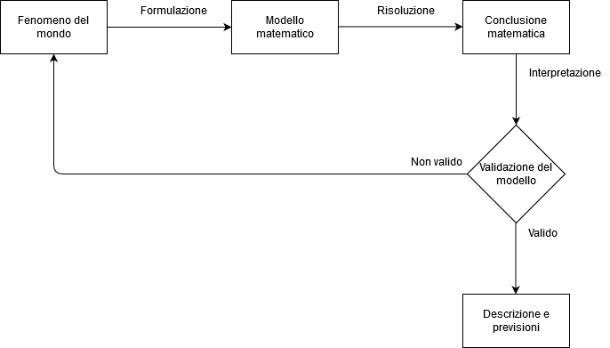
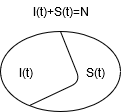
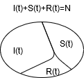
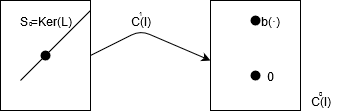

# Analisi II - quinta parte bis
## Equazioni differenziali e modelli matematici
### Modelli matematici

#### Esempi di modelli
+ Decadimento radioattivo
$N(t)=$ numero di radionuclidi al tempo $t$. $\frac{1}{τ}$ percentuale di radionuclidi che decadono nell'unità di tempo.
$\displaystyle N(t+h)=N(t)-\frac{h}{τ}N(t)$
+ $\displaystyle \begin{cases}N((n+1)h)=N(nh)(1-\frac{h}{τ}) \\ N(0)=N_0 \end{cases}$
+ $\displaystyle\lim_{h\to 0}\frac{N(1+h)-N(t)}{h}=-\frac{1}{τ}N(t)$, $\begin{cases} N'(t)=-\frac{1}{τ}N(t) \\ N(0)=N_0 \end{cases}$

+ Modello discreto $\displaystyle N(nh)=N_0(1-\frac{h}{τ})$
+ Modello continuo $\displaystyle N(t)=N_0e^{-\frac{1}{τ}t}$

### Dinamica delle popolazioni
#### Popolazione isolata
1. Risorse illimitate
  * $N(t)$ persone al tempo $t$ (densità di popolazione al tempo $t$)
  * $\nu$ natalità (tasso di natalità)
  * $μ$ mortalità (tasso di mortalità)

$N(t+h)=N(t)+\nu N(t)-μN(t)$
$N(t+h)=N(t)+(\underbrace{\nu-μ}_{σ})N(t)$
$\displaystyle\lim_{h\to 0} \frac{N(t+h)-N(t)}{h}=σN(t)$
$\begin{cases} N'(t)=σN(t) \\ N(0)=N_0 \end{cases}$, $N(t)=N_0e^{σt}$
2. Risorse limitate
$\begin{cases} N'(t)=σN(t)-εN^2(t)\text{ ,}(ε>0) \\ N(0)=N_0 \end{cases}$
modello di Verhulst (o logistico)
3. Popolazioni non isolate con risorse limitate
$\begin{cases} N'(t)=σN(t)-εN^2(t)+π(t) \begin{cases} π(t)>0 \text{ immigrazione} \\ π(t)<0 \text{ emigrazione}\end{cases}\\ N(0)=N_0 \end{cases}$
### Preda-predatore, Modello di Lotka-Volterra
$x(t)$ è il numero di prede
$y(t)$ è il numero di predatori
$\begin{cases}x'(t)=a\cdot x(t)-b\cdot x(t)y(t) \text{    a,b>0}\\ y'(t)=-c\cdot y(t)+d\cdot x(t)y(t) \text{     c>0}\\ x(0)=x_0 \\ y(0)=y_0 \end{cases}$
### Modello di epidemie
Malattia non mortale che non consente l'immunità
$I(t)$ numero di infetti
$S(t)$ numero di suscettibili alla malattia

$\begin{cases}I'(t)=βI(t)S(t) \\ S'(t)=-βI(t)S(t)\end{cases}$, Modello SIS, $S\to I\to S$, alternanza immunità/suscettibilità. ($β>0$)
$\begin{cases}I'(t)=βI(t)(N-I(t)) \\ I(0)=I_0\end{cases}$, Modello Logistico
### Malattria possibilmente mortale che comporta immunità
$I(t)$ numero di infetti
$S(t)$ numero di suscettibili alla malattia
$R(t)$ numero di recuperati/rimossi, non più suscettibili perchè immuni o morti
$\begin{cases}S'(t)=β\cdot I(t)S(t) \\ I'(t)=β\cdot I(t)S(t)-γI(t) \\ R'(t)=γI(t) \\ I(0)=I_0, S(0)=S_0, R(0)=R_0 \end{cases}$, Modello SIR, $S\to I\to R$

### $II$ legge della dinamica
$\begin{cases}m\cdot γ''(t)=F(t,γ(t),γ'(t)) \\ γ(t)=(x(t), y(t), z(t))^T \\ γ(t_0)=P_o \\ γ'(t_0)=v_0 \end{cases}$
### Linee di campo
Fato un campo vettoriale $g:A(\subseteq\mathbb{R}^n)\to\mathbb{R}^n$ si di ce che $γ:I(\subseteq\mathbb{R})\to A$, $I$ intervallo, è una linea di campo di $g$ se $γ?(t)=g(γ(t))$

(-- manca un'ora di venerdì 2019-11-08 --)

### Odine di un'equazione differenziale
È l'ordine massimo di derivazione con cui la funzione incognita compare nell'equazione differenziale
### EDO in forma normale
Sono EDO in cui la derivata di ordine massimo compare esplicitata
### EDO del primo ordine scalari in forma normale
+ Sia $f:E(\subseteq\mathbb{R}^2)\to\mathbb{R}$. Un'EDO in $\mathbb{R}^2$ del tipo $y'(x)=f(x,y(x))$ (o, sinteticamente, $y'=f(x,y)$) si dice EDO del $I$ ordine scalare in FN (forma normale), dove $y(\cdot)$ è la funzione incognita
+ Una funzione $y(\cdot ):I(\subseteq \mathbb{R}^2)\to \mathbb{R}$, $I$ *intervallo* si dice soluzione di $y'(x)=f(x,y(x))$ in $I$ se:
  1. $y(\cdot )$ è derivabile in $I$
  2. $(x,y(x))^T\in E, \forall x\in I$, cioè $G(y(\cdot ))\subseteq E$
  3. $y'(x)=f(x,y(x))$, $\forall x\in I$
### Interpretazione geometrica di un'EDO scalare del $I$ ordine in FN
Sia $f:E(\subseteq\mathbb{R}^2)\to\mathbb{R}$. Consideriamo l'EDO $y'=f(x,y(x))$ e associamo all'EDO il campo vettoriale $g:E(\subseteq\mathbb{R}^2)\to\mathbb{R}^2$, con $g(x,y)=\begin{pmatrix} 1 \\ f(x,y)\end{pmatrix}$. Sia $y(\cdot ):I(\subseteq\mathbb{R}^2)\to\mathbb{R}$ la soluzione dell'EDO. Associamo a $y(\cdot )$ la curva in forma cartesiana $γ:I(\subseteq \mathbb{R})\to \mathbb{R}^2$ con $γ(x)=\begin{pmatrix} x \\ y(x) \end{pmatrix}$. Risulta $sostg=G(y(\cdot ))$. Poichè $y'(x)=f(x,y(x))$, $\forall x\in I$ e quindi $\underline{γ'(x)}=\begin{pmatrix}1\\ y'(x) \end{pmatrix}=\begin{pmatrix}1\\f(x,y(x)) \end{pmatrix}=g(x,y(x))=\underline{g(γ(x))}$, $\forall x\in I$. Dunque $γ$ è una linea del campo del campo vettoriale $g$
### Problema di Cauchy (PC)
Siano $f:E(\subseteq\mathbb{R}^2)\to\mathbb{R}$ e $(x_0,y_0)\in E$.
Il problema: $\begin{cases}y'=f(x,y)\to \text{   EDO}\\y(x_0)=y_0\to \text{   Condizione Iniziale (CI)} \end{cases}$
si dice Problema di Cauchy
### Osservazione
Si cerca una linea di campo passante per $(x_0,y_0)^T$
### Soluzione di un PC
una funzione $y(\cdot ):I(\subseteq\mathbb{R}^2)\to\mathbb{R}$ si dice soluzione del PC se:
1. $y(\cdot)$ è soluzione di $y'=f(x,y)$
2. $y_0\in I$
3. $y(x_0)=y_0$
### Questioni
Dato il PC $\begin{cases}y'=f(x,y)\\ y(x_0)=y_0 \end{cases}$ si pongono le seguenti questioni:
1. Esistenza di (almeno) una soluzione
2. Unicità o molteplicità della soluzione
3. Dipendenza continua del dato iniziale
4. Studio qualitativo delle soluzioni
5. Studio quantitativo delle soluzione (analisi numerica)
Il PC è ben posto secondo Hadanard nei conronti di queste questioni
### Esistenza di una soluzione per il PC
#### Osservazione
(L'esistenza di una soluzione di un PC __non è in generale garantita__)

Supponiamo che esista una soluzion $y(\cdot):[-δ,+δ]=I\to \mathbb{R}$, $δ>0$. Si ha $y'(0)=-1$ (y decrecente in $0$) e quindi esiste $h>0$ t.c. $y(x)<y(0)$ se $0<x\le h$. Dall'equazione segue che $y'(x)=f(x,y(x))=1$ se $0<x\le h$ Dunque esiste $0=y(0)=\displaystyle\lim_{x\to 0^+} y(x)=y(x)<0$, il che è impossibile. $f$ è discontinua in $0$.
### Teorema di Peano
Se $f:A(\subseteq\mathbb{R}^2)\to\mathbb{R}$, $A$ aperto, è continua e $(x_o,y_0)^T\in A$ allora esistono un numero $h>0$e una funzione $y(\cdot):]x_0-h,x_0+h[\to \mathbb{R}$ soluzione del PC $\begin{cases}y'=f(x,y)\\y(x_0)=y_0 \end{cases}$
### Unicità della soluzione del PC
Il teorema di Peano non garantisce l'unicità della soluzione
### Teorema di Cauchy-Lipschitz di esistenza e unicità locali
Se $f:A(\subseteq\mathbb{R}^2)\to\mathbb{R}$, $A$ aperto,  continua con $\displaystyle \frac{\partial f}{\partial y}$ continua, e $(x_0,y_0)\in A$ allora esiste un numero $h>0$ ed __una ed una sola__ $y(\cdot)_I=]x_0-h,x_0+h[\to \mathbb{R}$ soluzione del PC $\begin{cases}y'=f(x,y)\\y(x_0)=y_0 \end{cases}$
### Osservazione
Nel teorema di Peano e nel teorema di Cauchy-Lipschitz si ha, poichè $y'(x)=f(x,y(x))$ in $]x_0-h,x_0+h[$ e $y(\cdot)$ e $f$ sono continue, che $y'(\cdot)$ è continua e quindi $y(\cdot)$ è di classe $C^1$
### Teorema di disuguaglianza continua del dato iniziale
Sia $f:A(\subseteq\mathbb{R}^2)\to\mathbb{R}$, $A$ aperto, continua con $\displaystyle \frac{\partial f}{\partial y}$ continua. Se $(x_0,y_0)^T\in A$ e $y(\cdot):]x_0-h,x_0+h[\to \mathbb{R}$ è soluzione di $\begin{cases}y'=f(x,y)\\y(x_0)=y_0 \end{cases}$, allora per ogni $ε>0$ esiste $δ>0$ t.c. $\forall z_0\in \mathbb{R}$, con $|z_0-y_0|<δ$, la soluzione di $z(\cdot)$ di $\begin{cases}z'=f(x,z)\\z(x_0)=z_0 \end{cases}$ è definita su $]x_0-h,x_0+h[$ e verifica $|z(x)-y(x)|<ε$, $\forall xi]x_0-h,x_0+h[$, $\Leftrightarrow$ ($||z(\cdot)-y(\cdot)||_{\infty}<ε$)
### Conseguenza
Sotto le ipotesi del teorema di Cauchy-Lipschitz il PC è ben posto
### Legge del prolungamento
Se $f:A(\subseteq\mathbb{R}^2)\to\mathbb{R}$, $A$ aperto, è continua e $y(\cdot):]a,b[\to \mathbb{R}$ è una oluzione di $y'=f(x,y)$ t.c. esiste un compatto $K\subseteq A$ per cui $G(y(\cdot))\subseteq K$, allora esiste $δ>0$ t.c. $y(\cdot)$ esiste su $[a-δ,b+δ]$
### Teorema dell'esistenza globale della soluzione del PC
Se $f:]a,b[\times \mathbb{R}\to\mathbb{R}$ è continua, $a\ge -\infty$, $b\le è\infty$, $(x_0,y_0)^T\in\underbrace{]a,b[\times \mathbb{R}}_{=A}$ e ogni compatto $H\subseteq ]a,b[$ eistono $α,β\in \mathbb{R}$ t.c. $|f(x,y)|\le α|y|+β$, $\forall (x,y)^T\in H\times \mathbb{R}$ (Condizione di sottolinearità), allora il PC $\begin{cases}y'=f(x,y)\\y(x_0)=y_0 \end{cases}$ ha almeno una soluzione $y(\cdot)$ definita su $]a,b[$
### Equazioni a variabili separate
Siano $g:]a,b[\to\mathbb{R}$, $a\ge -\infty$, $b\le +\infty$, continua e $h:]c,d[\to \mathbb{R}$, $c\ge -\infty$, $d\le +\infty$, di classe $C^1$.
Consideriamo il PC $\begin{cases}y'=f(x,y)\\y(x_0)=y_0 \end{cases}$, dove $x_0\in ]a,b[$, $y_0\in ]c,d[$. Poniamo $A=]a,b[\times]c,d[$ e $f:A\to\mathbb{R}$, $f(x,y)=g(x)h(y)$, $f$ è continua con $\displaystyle \frac{\partial f}{\partial y}$ continua in $A$. Quindi vale il teorema di esistenza e unicità locale
### Metodo risolutorio
Distinguiamo due casi. $\begin{cases}y'=g(x)h(y)\\y(x_0)=y_0 \end{cases}$
1. caso $h(y_0)=0$, la funzione $y(\cdot)=y_0$ è la soluzione del PC
2. caso $h(y_0)\neq 0$, sia $y(\cdot):]x_0-h,x_0+h[\to \mathbb{R}$ la soluzione del PC. Poichè $h(y(x_0))=h(y_0)\neq 0$ e, per il teorema della permanenza del segno, possiamo supporre che $h(y(x))\neq 0$ in $]x_0-h,x_0+h[$
Da $y'(t)=g(t)\underbrace{h(y(t))}_{\neq 0}$, segue $\int_{x_0}^x\displaystyle \frac{y'(t)}{h(y(t))}dt=\int_{x_0}^xy(t)dt$, $\forall x\in ]x_0-h,x_0+h[$, si ha $\displaystyle \int_{x_0}^x\frac{y'(t)}{h(y(t))}dt\underset{s=y(t)}{=}\int_{y(x_0)=y_0}^y(x)\frac{1}{h(s)}ds=\int_{x_0}^{x}g(t)dt$.
Siano $G$ e $K$ tali che $G'=g$ in $]a,b[$ e $K'(s)=\displaystyle \frac{1}{\underset{\neq 0}{h(s)}}$ in $Im(y(\cdot))$
Si ottiene
$K(y(x))-K(y_0)=G(x)-G(x_0)$ in $]x_0-h,x_0+h[$
$K(y(x))=G(x)+(\underbrace{K(y_0)-G(x_0)}_{\text{costante}})$. Poichè $K$ è invertibile in $Im(y(\cdot))$. Si conclude che $y(x)=K^{-1}(G(x)+K(y_0)-G(x_0))$ in $]x_0-h,x_0+h[$
### Difficoltà
+ Trovare le primitive $G$ e $K$
+ determinare $K^{-1}$
## Equazioni lineari scalari del $I$ ordine
#### Motivazioni
+ teoria generale completa
+ approssimazione di equazioni non lineari con equazioni lineari
### Principio di linearizzazione
Sia $f:A(\subseteq\mathbb{R}^2)\to\mathbb{R}$, $A$ aperto, di classe $C^1$ e $(x_0,y_0)^T\in A$. Si vuole approssimare $y(\cdot)$, soluzione del PC $\begin{cases}y'=f(x,y)\\y(x_0)=y_0 \end{cases}$ con la soluzione $z(\cdot)$ del problema "linearizzato" in $(x_o,y_0)^T$, cioè la soluzione di $\begin{cases}z'=f(x,z)\\z(x_0)=y_0 \end{cases}$, dove $\overline{f}(x,y)=f(x_0,y_0)+\underbrace{f_x(x_0,y_0)}_{β}(x-x_0)+\underbrace{f_y(x_0,y_0)}_{α}(y-y_0)$ è l'approssimazione di $f$ in $(x_0,y_0)^T$. Si ha $\overline{f}(x,y)=αy+βx+γ$, con $α,β,γ\in \mathbb{R}$.
$\begin{cases}z'=αy+βx+γ\\z(x_0)=z_0 \end{cases}$ dove l'quazione è lineare rispetto a $z$
### Osservazione
$y(\cdot)$ e $z(\cdot)$ sono di classe $C^2$ (in particolare $z(\cdot)$ è di classe $C^\infty$). Calcoliamo $y(x_0)=y_0=z(x_0)$, $y'(x_0)=f(x_0,y_0)=\overline{f}(x_0,y_0)=z'(x_0)$. $y''(x_0)=f_x(x_0,y_0)+f_y(x_0,y_0)y'(x_0)$, $z''(x_0)=f_x(x_0,y_0)+f_y(x_0,y_0)z'(x_0)=z'(x_0)$.
Quindi $y(\cdot)$ e $z(\cdot)$ hanno lo stesso polinomio di Taylor di ordine $2$ relativo a $x_0$ cioè $y(x)=p_{2,x_0(x)+o_1((x-x_0)^2)}$ e $z(x)=p_{2,x_0(x)+o_2((x-x_0)^2)}$. Si conclude allora che $|y(x)-z(x)|=|o_1((x-x_0)^2)-o_2((x-x_0)^2)|=o((x-x_0)^2)$
### EDO lineare scalare del $I$ tipo
#### Teoria
Siano $a(\cdot),b(\cdot):I\to \mathbb{R}$ con $I\subseteq \mathbb{R}$ intervallo aperto continuo.
L'EDO (c) $y'=a(x)y+b(x)$ si dice EDO lineare scalare del $I$ ordine __completa__
(o) $y'=a(x)y$ si dice EDO lineare scalare del $I$ ordine __omogenea__
#### NB
Qui $f(x,y)=a(x)\cdot y+b(x)$ è lineare rispetto a $y$, ma non necessariamente rispetto a $x$
### Teorema
Per ogni $x_0\in I$ e $y_0\in \mathbb{R}$, il PC $\begin{cases}y'=a(x)y+b(x)\\y(x_0)=y_0 \end{cases}$ ha una ed una sola soluzione definita su $I$.
### Dimostrazione
Si ha che $f(x,y)=a(x)y+b(x)$. $f:I\times \mathbb{R}\to \mathbb{R}$ è continua con $\displaystyle \frac{\partial f}{\partial y}(x,y)=a(x)$ continua e cresce al più linearmente in $y$
### Definizione
$L:C^1(I)\to C^0(I)$ ponendo $L(y(\cdot))=y'(\cdot)-a(\cdot)y(\cdot)$
### Teorema 1
$L:C^1\to C^0(I)$ è un'applicazione lineare
### Dimostrazione
Se $α,β\in \mathbb{R}$ e $y(\cdot),z(\cdot)\in C^1(I)$ allora $L(αy(\cdot)+βz(\cdot))=(αy(\cdot)+βz(\cdot))'-a(\cdot)(αy(\cdot)+βz(\cdot))=α(y'(\cdot)-a(\cdot)y(\cdot)+β(z'(\cdot)+a(\cdot)z(\cdot))=αL(y(\cdot))+βL(z(\cdot))$.
Si ha
(c) $y'=a(x)y+b(x)\Leftrightarrow L(y(\cdot))=b(\cdot)\Leftrightarrow y(\cdot)\in L^{-1}({b(\cdot)})=S_b$
(o) $y'=a(x)y+b(x)\Leftrightarrow L(y(\cdot))=0\Leftrightarrow y(\cdot)\in L^{-1}({0})=S_0=Ker(L)$

### Teorema 2 - descrizione di $S_b$
Le soluzioni di (c) sono tutte e sole le funzioni del tipo $y(\cdot)=\overline{y}(\cdot)+z(\cdot)$, dove $\overline{y}(\cdot)$ è una particolare soluzione di (c) e $z(\cdot )$ è una generica soluzione di (o), cioè $S_b=\overline{y}(\cdot)+S_0$
### Dimostrazione
+ se $y(\cdot)=\overline{y}(\cdot)+z(\cdot)$, si ha $L(y(\cdot))=L(\overline{y}(\cdot))+L(z(\cdot))=b(\cdot)+0=b(\cdot)$
+ se $y(\cdot),\overline{y}(\cdot)$ sono soluzioni di (c), allora, posto $z(\cdot)=y(\cdot)-\overline{y}(\cdot)$. Si ha $L(z(\cdot))=L(y(\cdot))-L(\overline{y}(\cdot))=b(\cdot)-b(\cdot)=0$, cioè $z(\cdot)$ è soluzione di (o)
### Teorema 3 (descrizione di $S_0=KerL$)
$S_0=KerL=\{c\cdot e^{A(\cdot)}:c\in \mathbb{R}\}$ con $A(\cdot)$ una primitiva di $a(\cdot)$ su $I$ (cioè $A'(x)=a(x)$ in $I$)
### Dimostrazione
$\{c\cdot e^{A(\cdot)}:c\in \mathbb{R}\}\subseteq KerL$
Posto $z(\cdot)=ce^{A(x)}\cdot A'(x)=a(x)z(x)$ in $I$. $z(\cdot)$ è soluzione di (o).
$KerL\subseteq \{ce^{A(\cdot)}:c\in \mathbb{R}\}$. Sia $z(\cdot)$ una soluzione di (o), cioè $\forall x\in I$, $z'(x)=a(x)z(x)$ e quindi $\underbrace{z'(x)e^{-A(x)}-a(x)e^{-A(x)}z(x)}_{\frac{d}{dx}(z(x)e^{-A(x)})}=0$.
Cioè ${\frac{d}{dx}(z(x)e^{-A(x)})}=0$. Dunque esiste $c\in \mathbb{R}$ t.c. $z(x)e^{-A(x)}=c$ in $I$. Si conclude così che $z(x)=ce^{A(x)}$ in $I$.
#### NB $dimKerL=1$
### Teorema 4 (Determinazione di una soluzione particolare di (c) )
Una soluzione particolare di (c) è $\overline{y}(x)=e^{A(x)}\int_{x_0}^xe^{-A(t)}b(t)dt$, con $x_0\in I$ finito
### Dimostrazione (Metodo della variazione delle costanti)
Si cerca una soluzione particolare di (c) del tipo $\overline{y}(\cdot)=c(x)e^{A(x)}$, con $c(\cdot):I\to \mathbb{R}$, funzione di classe $C^1$ da determinare. Imponiamo che $y(\cdot)$ risolva (c), cioè $\overline{y}(\cdot)=a(x)\overline{y}(\cdot)+b(x)$ in $I$ $\Leftrightarrow$ $c'(x)e^{A(x)}+c(x)a(x)e^{A(x)}=a(x)c(x)e^{A(x)}+b(x)$ in $I$ $\Leftrightarrow$ $c'(x)=b(x)e^{-A(x)}$ in $I$. Fissiamo $x_0\in I$ e poniamo $c(x)=\int_{x_0}^xb(t)e^{-A(x)}dt$ in $I$.
La funizione $\overline{y}(x)=e^{A(x)}|int_{x_0}^xe^{-A(t)}b(t)dt$ risolve (c)
### Corollario 1
La generica soluzione di (c) è $y(x)=ce^{A(x)}+e^{A(x)}\int_{x_0}^xe^{-A(t)}b(t)dt$, $\forall x\in I$, con $c\in \mathbb{R}$ e $x_0\in I$
### Corollario 2
$\forall x_0\in I$ e $y\in \mathbb{R}$ il PC $\begin{cases}y'=f(x,y)\\y(x_0)=y_0 \end{cases}$ ha una e una sola soluzione definita su $\mathbb{R}$ data da $y(x)=y_0\exists +\int_{x_0}^x e^{A(x)-A(t)}b(t)dt$
### Teorema 5 (Principio di sovrapposizione)
Se $y_1(\cdot)$ è una soluzione di $y'=a(x)y+b_1(x)$ e $y_2(\cdot)$ è una soluzione di $y'=a(x)y+b_2(x)$, allora $y_1(\cdot )+y_2(\cdot )$ è soluzione di $y'=a(x)y+[b_1(x)+b_2(x)]$
### Dimostrazione
Si ha $L(y_1(\cdot )+y_2(\cdot ))=L(y_1(\cdot))+L(y_2(\cdot))=b_1(\cdot)+b_2(\cdot)$
### L'EDO di Bernoulli
L'EDO $y'=a(x)y+b(x)y^γ$ con $a(\cdot),b(\cdot):I\to \mathbb{R}$, $I$ intervallo aperto, continua e $γ\in \mathbb{R}\setminus\{0,1\}$, si dice equazione di Bernoulli. Si cercano le soluzioni $y(\cdot)$ con $y(x)>0$ in $Dom(y(\cdot))$.
Sia $y(\cdot)$ una soluzione e si divida per $y(\cdot)^γ$. Si ottiene $\displaystyle \frac{y'(x)}{y(x)^γ}=a(x)y(x)^{1-γ}+b(x)$ cioè $\displaystyle \frac{d}{dx}(\frac{1}{1-γ}y(x)^{1-γ})=(1-γ)a(x)(\frac{1}{1-γ}y(x)^{1-γ})+b(x)$, cambio di variabile (dipendente), si ponga $u(x)=\displaystyle \frac{1}{1-γ}y(x)^{1-γ}$. Allora l'EDO diventa: $u'(x)=(1-γ)a(x)u(x)+b(x)$ che è un EDO lineare del $I$ ordine

