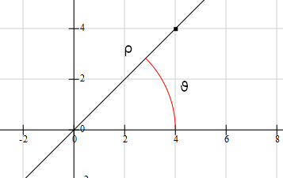

# Analisi II - quinta parte
## Coordinate polari

$\begin{cases} x=ρcosϑ \\ y=ρsinϑ \end{cases}$
+ $(x,y)^T$ coordinate cartesiane
+ $(ρ,ϑ)^T$ coordinate polari, $ρ=||(x,y)^T||=\displaystyle \sqrt{x^2+y^2}$

## Curve in $\mathbb{R}^n$ ($n=2,3$)
### Curve in forma parametrica
Sia $γ:I(\subseteq \mathbb{R})\to \mathbb{R}^n$, con $I$ intervallo. La coppia $(γ, \underbrace{γ(I)}_{=\Gamma})$ si dice curva in forma parametrica di cui $γ$ è la rappresentazione parametrica e $\Gamma=γ(I)$ è il sostegno
+ $N=2$, $γ(t)=(x(t),y(t))^T$, $t\in \mathbb{R}$
oppure $\begin{cases} x=x(t) \\ y=(t)  \end{cases}$, $t\in I$
+ $N=3$, $γ(t)=(x(t),y(t),z(t))^T$, $t\in \mathbb{R}$
oppure $\begin{cases} x=x(t) \\ y=(t) \\ z=z(t)  \end{cases}$, $t\in I$

### Curva in forma parametrica chiusa
Si dice che $γ$ è una curva in forma parametrica __chiusa__ se $I=[a,b]$ e $γ(a)=γ(b)$
### Curva in forma parametrica semplice
Si dice che $γ$ è una curva in forma parametrica __semplice__ se $\forall t_1,t_2$, con $t_1\neq t_2$ e almeno uno fra $t_1$ e $t_2$ interno ad $I$, si ha che $γ(t_1)\neq γ(t_2)$
#### NB
È permesso che $γ(a)=γ(b)$, se $I=[a,b]$
### Curva in forma parametrica regolare
Si dice che $γ$ è una curva in forma parametrica __regolare__ se $γ\in C^1(I)$ e $γ'(t)\neq \underline{0}$, $\forall t\in intI$.
Si dice che $γ'(t)$, $t\in intI$ è il vettore tangente e si pone $\displaystyle τ(t)=\frac{γ'(t)}{||γ'(t)||}$, $τ$ versore tangente
### Retta tangente a una curva regolare semplice in forma parametrica
Sia $γ$ una curva in forma parametrica regolare semplice e sia $t_0\in intI$.
La retta in forma parametrica $r(s)=γ(t_o)+γ'(t_o)s$, con $s\in \mathbb{R}$, si dice retta tangente nel punto $γ(t_o)$
## Curve in $\mathbb{R}^2$
### Curve regolari in forma cartesiana in $\mathbb{R}^2$
Sia $f:I(\subseteq\mathbb{R}^2)\to\mathbb{R}$, $I$ intervallo, di classe $C^1$, la curva in forma parametrica $γ:I\to \mathbb{R}^2$, con $γ(t)=\begin{pmatrix}t \\ f(t)\end{pmatrix}$ si dice curva __regolare__ in forma cartesiana. Si ha: $γ'(t)=\begin{pmatrix} 1 \\ f'(t)\end{pmatrix}\neq \underline{0}$, in $I$ e il $sost(γ)=γ(I)$.
### Curve regolari in forma polare in $\mathbb{R}^2$
Sia $ρ:I(\subseteq \mathbb{R})\to \mathbb{R}$, con $I$ intervallo, di classe $C^1$ e t.c. $ρ(ϑ)\ge 0$ in $I$ e $ρ(ϑ)+ρ'(ϑ)>0$ in $intI$.
La curva $γ:I\to \mathbb{R}^2$, con $γ(ϑ)=\begin{pmatrix} ρ(ϑ)cosϑ \\ ρ(ϑ)sinϑ \end{pmatrix}$, si dice curva __regolare__ in forma polare.
Si ha $γ'(ϑ)=(ρ(ϑ)^2-ρ(ϑ)sinϑ,ρ'(ϑ)sinϑ-ρ'(ϑ)cosϑ)^T$ e quindi $||γ'(ϑ)||^2=(ρ(ϑ)cos^2ϑ-ρ(ϑ)^2sin^2ϑ-\cancel{2ρ(ϑ)cosϑsinϑ}+ρ(ϑ)^2sin^2ϑ+ρ'(ϑ)cos^2ϑ+\cancel{2ρ'(ϑ)^2cosϑsinϑ})=ρ(ϑ)^2+ρ'(ϑ)>0$
### Curve in $\mathbb{R}^2$ definite da equazioni
Si considera una funzione $φ:A(\subseteq \mathbb{R}^2)\to \mathbb{R}$ e il suo insieme di livello zero, $L_0(φ)=\{(x,y)^T\in A:φ(x,y)=0\}$.
Se $\nabla φ=0$, $L_0(φ)$ non è unidimensionale, infatti dove $\nabla φ=0$ può essere che non ci sia tangente o che ci sia $L_0(φ)$ bidimensionale.
Se $\nabla φ\neq 0$ si può parlare di curve definite da equazioni
### Punti regolari e punti singoli
Sia $φ:A(\subseteq\mathbb{R}^2)\to\mathbb{R}$, $A$ aperto, di classe $C^1$ in $A$. Un punto $\underline{x}^0=(x_0,y_0)^T\in L_0(φ)$ si dice __regolare__ se $\nabla φ(\underline{x}^0)\neq \underline{0}$, __singolare__ altrimenti.
### Teorema di parametrizzazione locale (o della funzione implicita o di Dimi)
Se $φ:A(\subseteq\mathbb{R}^2)\to\mathbb{R}$, $A$ aperto, di classe $C^1$ e $\underline{x}^0=(x_0,y_0)^T$ è un punto regolare, $\nabla φ(\underline{x}^0)\neq \underline{0}$, con $φ(\underline{x}^0)=0$, allora esiste un intorno $U$ di $x_0$, un intorno $V$ di $y_0$, $g:U\to V$ e $h:V\to U$, $g,h\in C^1$ t.c. $L_0(φ)\cap (U\times V)=\begin{cases} G(g) \\ G(h) \end{cases}=$(*), a seconda di cosa posso definire. In base a cosa decido? In base a quale derivata parziale è $\neq 0$. Se lo sono entrambe cerco la funzione inversa di $y$
(*)$=\begin{cases} G(g) \text{ se } φ_g(x_0,y_0)\neq 0 \\ G(h) \text{ se } φ_h(x_0,y_0)\neq 0 \end{cases}$. Inoltre si ha:
$g'(x)=-\frac{φ_x(x,g(x))}{φ_y(x,h(x))}$, $\forall x\in U$, $φ_y(x^0,y^0)\neq 0$ oppure $h'(y)=-\frac{φ_y(h(y),y)}{φ_x(g(y),y)}$, $\forall y\in V$, $φ_x(x^0,y^0)\neq 0$. 
In particolare, la retta tangente a $L_0(φ)$ in $(x^0,y^0)^T$ ha equazione $y=g(x^0)+g'(x^0)(x-x^0)\Leftrightarrow y-y^0=-\frac{φ_x(x^0,y^0)}{φ_y(x^0,y^0)}(x-x^0)$ (1), se $φ_y(x^0,y^0)\neq 0$ oppure $x=h(y^0)+h'(y^0)(y-y^0)\Leftrightarrow x-x^0=-\frac{φ_y(x^0,y^0)}{φ_x(x^0,y^0)}(y-y^0)$ (1), se $φ_x(x^0,y^0)\neq 0$.
(1)(2) e quindi $\Leftrightarrow$ $φ_x(x^0,y^0)(x-x^0)+φ_y(x^0,y^0)(y-y^0)=0$. $<\nabla φ(\underline{x}^0),\underline{x}-\underline{x}^0>=0$, allo stesso modo trovo lo stesso prodotto scalare per $φ_x(x^0,y^0)=0$, cioè $\nabla φ(\underline{x}^0)$ è $\bot (\underline{x}-\underline{x}^0)$

### Conseguenze
Sotto le ipotesti del sopracitato teorema si ha $\nabla φ(\underline{x}^0)$ è ortogonale alla retta tangente a $L_0(φ)$ nel punto $\underline{x}^0$ e quindi a $L_0(φ)$ nel punto $0$
### Osservazione
$λ(φ)\cap (υ\times V)=G(g)\Rightarrow φ(x,g(x))=0$ in $U$. Si ha che la funzione $y=g(x)$ è definita in modo implicito dall'equazione $φ(x,y)=0$ e della condizione $g(x^0)=y^0$.
### Definizione
Sia $φ:A(\subseteq\mathbb{R}^2)\to\mathbb{R}$, $A$ aperto, di classe $C^1$, tale che $L_0(φ)=\{(x,y)\in A|φ(x,y)=0\}\neq \emptyset$ e $\nabla φ(x,y)\neq 0$ per ogni $(x,y)^T\in L_0(φ)$. La coppia $(φ,L_0(φ))$ si dice curva regolare in forma __implicita__ di $φ(x,y)=0$. $φ(x,y)=0$ è l'equazione e $L_0(φ)$ è il sostegno.
### Definizione
Siano $A(\subseteq \mathbb{R}^2)$ aperto connesso e $σ=K=clA(\subseteq \mathbb{R}^2)$, con $σ(u,v)=(x(u,v), y(u,v), z(u,v))^T$. Supponiamo allora che:
1. $σ$ è di classe $C^1$ in $intK$
2. $\forall \underline{u}=(u,v)^T\in intK$, $σ_u(x_u(u,v), y_u(u,v), z_u(u,v))^T$ e $σ_v(u,v)=(x_v(u,v),y_v(u,v),z_v(u,v))^T$ sono linearmente indipendenti. Ossia $σ_u(u,v)\times σ_v(u,v)\neq 0$
3. $\forall u_1,u_2\in K$, con $u_1\neq u_2$ e $u_1\in intK$ e $u_2\in intK$, allora si ha $σ(u_1)\neq σ(u_2)$. La coppia formata da $(σ,σ(k))$ si dice __superficie__ regolare sempline in forma parametrica, di cui $σ$ è la parametrizzazione e $\Sigma=σ(κ)$ è il __sostegno__.
### Definizione
Sia $σ:K(\subseteq \mathbb{R}^2\to \mathbb{R}^3$ una superficie regolare semplice in forma parametrica. Fisso un $\underline{u}^0=(u^0,v^0)^T\in intK$ e sia il punto $\underline{x}^0=σ(\underline{u})\in\Sigma$. Le curve $σ(\cdot, v^0):]u^0-δ,u^0+δ[\to \mathbb{R}^2$ e $σ(u^0,\cdot ):]v^0-δ,v^0+δ[\to \mathbb{R}^2$ sono regolari semplici e si dicono __linee coordinate__ passanti per $\underline{x}^0$
### Definizione
Il vettore $σ_u(u^0,v^0)$ è il vettore tangente alla linea coordinata da $u$ in $\underline{x}^0$ e il vettore $σ_v(u^0,v^0)$ è il vettore tangente alla linea coordinata $v$ in $\underline{x}^0$. Il vettore $σ_v(u^0,v^0)\times σ_u(u^0,v^0)$ si dice vettore __normale__ a $\Sigma$ in $\underline{x}^0$ e invece il versore dato da $\displaystyle \nu(u^0,v^0)=\frac{σ_v(u^0,v^0)\times σ_u(u^0,v^0)}{||σ_v(u^0,v^0)\times σ_u(u^0,v^0)||}$ è il __vettore normale__ a $\Sigma$ in $\underline{x}^0$
### Definizione
Il piano generato da $σ_u(u^0,v^0)$ e $σ_v(u^0,v^0)$ passante per $\underline{x}^0$ si dice piano tangente a $\Sigma$ in $\underline{x}^0$, ed è rappresentato da:
1. $\underline{x}=λσ_u(u^0,v^0)+\mu σ_v(u^0,v^0)+\underline{x}^0$, $\forall (λ,\mu)\in \mathbb{R}^2\to$rappresentazione __parametrica__
2. $<σ_u(u^0,v^0)\times σ_v(u^0,v^0),\underline{x}-\underline{x}^0>=0\to$ rappresentazione implicita.
### Definizione
Sia $f:K=clA(\subseteq \mathbb{R}^2)\to \mathbb{R}$, con $A$ aperto e connesso, di classe $C^1$ in $intK$. La superficie in forma parametrica $σ(u,v)$, dato che $σ(u,v)=(u,v,f(u,v))^T$, con $(u,v)\in K$, è una superfice regolare semplice, dove $\Sigma=σ(K)=G(f)$ e inoltre vale: $\displaystyle σ_u\times σ_v=\begin{pmatrix} 1 \\ 0 \\ f_u\end{pmatrix}\times \begin{pmatrix} 0 \\ 1 \\ f_v \end{pmatrix}=det \begin{pmatrix} e_1\text{   }e_2\text{   }e_3 \\ 1\text{     }0\text{   }f_u\\ 0\text{   }1\text{   }f_v \end{pmatrix}=\begin{pmatrix}-f_u \\ -f_v \\ 1 \end{pmatrix}$ 
### Definizione
Sia $φ:A(\subseteq\mathbb{R}^2)\to\mathbb{R}$, $A$ aperto, di classe $C^1$. supponiamo che $\Sigma=L_0(φ)=\{(x,y,z)^T=0\}\neq \emptyset$ e per ogni $(x,y,z)^T\in L_0(φ)$ sia $\nabla φ(x,y,z)\neq 0$. La coppia $(φ,L_0(φ))$ si dice superficie regolare in forma __implicita__ di cui $φ(x,y,z)=0$ è l'equazione e $\Sigma=L_0(φ)$ è il sostegno. Il piano tangente a $\Sigma$ in $\underline{x}^0$ è rappresentato dall'equazione $<\nabla φ(\underline{x}^0), \underline{x}-\underline{x}^0>=0$.
### Definizione, Curve regolari in forma implicita in $\mathbb{R}^3$
Siano $φ,\psi:A(\subseteq \mathbb{R}^3)\to \mathbb{R}$, con $A$ aperto e di classe $C^1$, tali che $\Gamma=L_0(φ)\cap L_0(\psi)=\{(x,y,z)^T\ | φ(x,y,z)=0, \psi(x,y,z)=0\}\neq \emptyset$ e $\nabla φ(x,y,z)\times \nabla \psi(x,y,z)\neq 0$, per ogni $(x,y,z)^T\in L_0(φ)\cap L_0(\psi)=\Gamma$. La coppia $((φ,\psi),L_0(φ)\cap L_0(\psi))$ si dice curva regolare in forma implicita in $\mathbb{R}^3$ di cui $\begin{cases} φ(x,y,z)=0 \\ \psi(x,y,z)=0\end{cases}$ sono le equazioni e $\Gamma=L_0(φ)\cap L_0(\psi)$ è il sostegno. Il vettore $\nabla φ(\underline{x}^0)\times \psi(\underline{x}^0)$ è il vettore tangente a $\Gamma$ in $\underline{x}^0$, e la retta $\underline{x}=\underline{x}^0+t(\nabla φ(\underline{x}^0)\times \psi(\underline{x}^0))$, $t\in \mathbb{R}$ è la retta tangente a $\Gamma$ in $\underline{x}^0$ , questa è la forma parametrica.
Considero un altro modo per scriverlo: $\begin{cases} <φ(\underline{x}^0),\underline{x}-\underline{x}^0>=0\text{   }(\text{piano tangente a }L_0(φ)) \\ <\psi(\underline{x}^0),\underline{x}-\underline{x}^0>=0\text{   }(\text{piano tangente a }L_0(φ)) \end{cases}$
### Lo studio deli estremi di $f:E(\subseteq\mathbb{R}^n)\to\mathbb{R}$, $A$ aperto, di classe $C^1$
Si artocola
+ nello studio degli estremi in $intE$, studio degli estremi liberi
+ nello studio degli estremi in $frE$, studio degli estremi vincolati
#### Estremi vincolati
##### Vincolo
Se $f:E(\subseteq\mathbb{R}^n)\to\mathbb{R}$. Un insieme $\emptyset\neq \underline{0}V\underset{\neq}{\subset}E$ si dice vincolo per $f$
##### Punti di estremo vincolato
Siano $f:E(\subseteq\mathbb{R}^n)\to\mathbb{R}$ e $V$ un vincolo per $f$. Si dice che $\underline{x}^0\in V$ è un punto di estremo vincolato per $f$ se $V$ se $\underline{x}^0$ è t.c. $f(\underline{x})>f(\underline{x}^0)$, $\forall x\in U\cap V$, $\underline{x}\neq \underline{x}^0$ (minimo vincolato) oppure $f(\underline{x})<f(\underline{x}^0)$, $\forall x\in U\cap V$, $\underline{x}\neq \underline{x}^0$ (massimo vincolato) 
---
### Consideriamo
$N=2$, $V=\Gamma$, curva $\begin{cases} \text{Curva regolare in forma parametrica in }\mathbb{R}^2 \text{(T5)} \\ \text{curva regolare in forma implicita in }\mathbb{R}^2 \text{(T5)}\end{cases}$, $V$ può anche essere solo un punto,
$N=3$, $V=\begin{cases} \text{curva,}\Gamma\begin{cases}\text{curva regolare in forma parametrica (T1)} \\ \text{curva regolare in forma implicita (T5)}\end{cases}\text{, }V\text{ può anche essere intervalli o altri tipi di insieme} \\ \text{superficie,}\Sigma \begin{cases} \text{superficie regolare in forma parametrica (T2)} \\ \text{superficie regolare in forma implicita (T4)}\end{cases} \text{ in } \mathbb{R}^3\end{cases}$

#### Teorema (T3) ($N=2$ o $N=3$, $V=\Gamma$, curva in forma parametrica)
Sia $f:A(\subseteq\mathbb{R}^n)\to\mathbb{R}$, $A$ aperto, di classe $C^1$. Sia $γ:ι\to A$ una curva regolare, $I$ intervallo. e $\underline{x}^0=γ(t^0)$, con $t^0\in intI$ è un punto di estremo vincolato per $f$ su $\Gamma=γ(I)$, allora $<\nabla f(\underline{x}^0),γ'(t^0)>=0$
#### Osservazione
Se $\nabla f(\underline{x}^0)\neq \underline{0}$, allora $\nabla f(\underline{x}^0)$ è $\bot$ a $L_f(\underline{x}^0)(f)$ e a $\Gamma$ in $\underline{x}^0$ e quindi $L_f(\underline{x}^0)(f)$ e $\Gamma$ sono tangenti in $\underline{x}^0$
#### Dimostrazione
Studiare $f_{|_{\Gamma}}$ equivale a studiare la funzione $\psi:I\to \mathbb{R}$, con $\psi(t)=f(γ(t))$. Poichè $f_{|_{\gamma}}$ ha un punto di estremo in $\underline{x}^0$, $\psi$ ha un punto di estremo in $t^0$ con $γ(t^0)=\underline{x}^0$, $t^0\in intI$. Essendo $f$ e $γ$ di classe $C^1$, $\psi$ è di classe $C^1$. Quindi per il teorema di Fermat $0=\psi '(t^0)=<\nabla f(γ(t^0)),γ'(t^0)>=<\nabla f(\underline{x}^0),γ'(t^0)>$.
#### Teorema (T2) ($N=3$, $V=\Sigma$, superficie regolare in forma parametrica)
Sia $f:A(\subseteq\mathbb{R}^3)\to\mathbb{R}$, $A$ aperto, di classe $C^1$ e sia $σ:k\to A$  una superficie regolare semplice. Se $\underline{x}^0=σ(μ^0)$, con $u^0\in intK$, è un punto di etremo per $f$ su $\Sigma=σ(K)$, allora 
(-- MANCA TESI --)  
#### Osservazione
Se $\nabla f(\underline{x}^0)\neq 0$, allora $\nabla f(\underline{x}^0)\bot σ_u(\underline{u}^0)$ o $\nabla f(\underline{x}^0)\bot σ_v(\underline{u}^0)$  e quindi $\nabla f(\underline{x}^0)$ è $\bot$ al piano tangente $\Sigma$ in $\underline{x}^0$, cioè $\nabla f(\underline{x}^0)\bot\Sigma$.
Poichè $\nabla f(\underline{x}^0)\bot L_{f(\underline{x}^0)}(f)$, si conclude che $\Sigma$ e $L_{f(\underline{x}^0)}(f)$ sono tangenti in $\underline{x}^0$
#### Problema
Es. estremi di $f(x,y)=x+y$, su $x^4+y^4-4xy=1\to$ curva regolare in forma implicita
#### Teorema (T3), ($N=2, V=\Gamma$, curva regolare in forma implicita o dei moltiplicatori di Lagrange)
Siano $\underset{φ}{f}:E(\subseteq\mathbb{R}^2)\to\mathbb{R}$, aperto, di classe $C^1$. Se $\underline{x}^0\in \Gamma=L_0(φ)=\{(x,y)^T=φ(x,y)=0\}$ è un punto di estremo vincolato di $f$ su $\Gamma$ e $\nabla φ(\underline{x}^0)\neq \underline{0}$, allora esiste $λ\in \mathbb{R}$ t.c. $\nabla f(\underline{x}^0)=λ\nabla φ(\underline{x}^0)$
#### Dimostrazione
Poichè $\nabla φ(\underline{x}^0)\neq \underline{0}$ il teorema di parametrizzazione locale (Dini) garantisce che $\exists$ un intorno $W$ di $\underline{x}^0$ e $\exists$ una curva regolare in forma parametrica $γ:I\in \mathbb{R}^2$ t.c. $γ(I)=\Gamma=L_0(φ)\cap W$. ($\Rightarrow$ localmente il vincolo è una curva parametrica $\Rightarrow$ applico (T1)).
Per (T1) si ha $<f(\underline{x}^0),γ'(t^0)>=0$, dove $\underline{x}^0=γ(t^0)$ e $t^o\in intI$. D'altra parte $\nabla φ(\underline{x}^0)\bot γ'(t^0)$, $<\nabla φ(\underline{x}^0), γ'(t^0)>=0$ e quindi $\nabla  f(\underline{x}^0)$ e $\nabla φ(\underline{x}^0)$ sono paralleli, cioè esistono $α,β\in \mathbb{R}$ t.c. $α\nabla f(\underline{x}^0)+β\nabla φ(\underline{x}^0)=\underline{0}$, con $α,β$ non entrambi nulli. Poichè $α=0$ implicherebbe $\nabla  φ(\underline{x}^0)=0$ dev'essere $α\neq 0$. Posto $λ=-\frac{β}{α}$, si conclude che $\nabla f(\underline{x}^0)=λ\cdot \nablaφ(\underline{x}^0)$
#### Teorema dei moltiplicatori di Lagrange ($N=2$, $V=\Gamma$, curve in forma implicita)
Siano $f,φ:a(\subseteq\mathbb{R}^2)\to\mathbb{R}$, $A$ aperto, di classe $C^1$ e sia $\Gamma=L_0(γ)=\{(x,y)^T\in A:φ(x,y)=0\}$.
Se $\underline{x}^0=(x^0,y^0)\in \Gamma$ è un punto di estremo vincolato per $f$ su $\Gamma$ e $\nabla φ(\underline{x}^0)\neq \underline{0}$ allora esiste $x\in \mathbb{R}$ t.c. $\nabla f(\underline{x}^0)=λ\cdot \nabla φ(\underline{x}^0)$
#### Osservazione: uso del teorema dei moltiplicatori di Lagrange
1. Se $\Gamma$ è una curva regolare in forma implicita, cioè $\nabla φ\neq 0$, $\forall \underline{x}\in \Gamma$ allora i punti di estremo vincolato di $f$ su $\Gamma$ si ricercano tra le soluzioni $\underline{x}=(x,y)^T$ di 
(L)$\begin{cases}f_x(x,y)=λφ_x(x,y) \\ f_y(x,y)=λφ_y(x,y)\end{cases} \\ φ(x,y)=0$. (tre incognite $x,y,λ$ anche se $λ$ è di relativa impotanza)
2. Se $\Gamma$ non è una curva regolare in forma implicita, cioè esistono punti singolari, allora i punti di estremo vincolato di $f$ su $\Gamma$ vanno ricercati tra le soluzioni di (L), ma anche tra le soluzioni di 
$\begin{cases}  φ_x(x,y)=0 \\  φ_y(x,y)=0 \\  φ(x,y)=0\end{cases}$

#### Teorema dei moltiplicatori di Lagrange ($N=3$, $V=\Sigma$ superficie in forma implicita)
Siano $f,φ:A(\subseteq\mathbb{R}^3)\to\mathbb{R}$, $A$ aperto, di classe $C^1$ e sia $\Sigma =\{(x,y,z)^T\in A:φ(x,y,z)=0\}=L_0(φ)$.
Se $\underline{x}^0=(x^0,y^0,z^0)^T\in \Sigma$ è punto di estremo vincolato per $f$ su $\Sigma$ e $\nabla φ(\underline{x}^0)\neq \underline{0}$, allora esiste $λ\in \mathbb{R}$ t.c. $\nabla f(\underline{x}^0)=λ\nabla φ(\underline{x}^0)$
#### Osservazione: uso del teorema dei moltiplicatori di Lagrange
I punti di estremo vincolato per $f$ su $\Sigma$ vanno ricercati tra le soluzioni di:
+ punti regolari $\begin{cases}\nabla f(\underline{x})=λ\cdot \nabla φ(\underline{x}) \\ φ(\underline{x})=0 \end{cases}$
+ punti singolari $\begin{cases}\nabla φ(\underline{x})=\underline{0} \\ φ(\underline{x})=0 \end{cases}$
#### Teorema ($N=3$, $V=\Sigma$ curva in forma implicita)
Siano $f,F,\psi:A(\subseteq\mathbb{R}^3)\to\mathbb{R}$, $A$ aperto, di classe $C^1$. Sia $\Gamma =L_0(φ)\cap L_0(\psi)$, ossia in forma esplicita $\Gamma =L_0(φ)\cap L_0(\psi)=\{(x,y,z)^T:φ(x,y,z)=\psi(x,y,z)=0\}$. Se $\underline{x}^0=(x^0,y^0,z^0)^T\in \Gamma$ è un estremo vincolato per $f$ su $\Gamma$ e $\nabla φ(\underline{x}^0)\times \nabla \psi(\underline{x}^0)\neq \underline{0}$, allora esistono $λ,μ\in \mathbb{R}$, detti __moltiplicatori di Lagrange__, tali che $\nabla f(\underline{x}^0)=λ\nabla φ(\underline{x}^0)+μ\nabla \psi(\underline{x}^0)$.
#### Osservazione
Se $\Gamma$:
1. è una curva regolare in forma implicita, cioè $\nabla φ\times \nabla \psi\neq \underline{0}$ in $\Gamma$, allora i punti di estremo vincolato per $f$ su $\Gamma$ vanno cercati tra:
($\text{S}_1$)$\begin{cases} f_x(x,y,z)=λ\nabla φ_x(x,y,z)+μ\nabla \psi_x(x,y,z) \\ f_y(x,y,z)=λ\nabla φ_y(x,y,z)+μ\nabla \psi_y(x,y,z) \\ f_z(x,y,z)=λ\nabla φ_z(x,y,z)+μ\nabla \psi_z(x,y,z) \\ φ(x,y,z)=0 \\ \psi(x,y,z)=0 \end{cases}$ 
2. Se $\Gamma$ non è una curva regolare in forma implicita, cioè ci sono punti singolari, i punti di estremo vincolato vanno cercati tra le soluzioni di ($\text{S}_1$) e di
$\begin{cases} \nabla φ(x,y,z)\times\nabla \psi(x,y,z)=\underline{0} \\ φ(x,y,z)=0 \\ \psi(x,y,z)=0 \end{cases}$ si hanno cinque equazioni in tre incognite

## Equazioni differenziali e modelli matematici
### Modelli matematici

#### Esempi di modelli
+ Decadimento radioattivo
$N(t)=$ numero di radionuclidi al tempo $t$. $\frac{1}{τ}$ percentuale di radionuclidi che decadono nell'unità di tempo.
$\displaystyle N(t+h)=N(t)-\frac{h}{τ}N(t)$
+ $\displaystyle \begin{cases}N((n+1)h)=N(nh)(1-\frac{h}{τ}) \\ N(0)=N_0 \end{cases}$
+ $\displaystyle\lim_{h\to 0}\frac{N(1+h)-N(t)}{h}=-\frac{1}{τ}N(t)$, $\begin{cases} N'(t)=-\frac{1}{τ}N(t) \\ N(0)=N_0 \end{cases}$

+ Modello discreto $\displaystyle N(nh)=N_0(1-\frac{h}{τ})$
+ Modello continuo $\displaystyle N(t)=N_0e^{-\frac{1}{τ}t}$

### Dinamica delle popolazioni
#### Popolazione isolata
1. Risorse illimitate
  * $N(t)$ persone al tempo $t$ (densità di popolazione al tempo $t$)
  * $\nu$ natalità (tasso di natalità)
  * $μ$ mortalità (tasso di mortalità)

$N(t+h)=N(t)+\nu N(t)-μN(t)$
$N(t+h)=N(t)+(\underbrace{\nu-μ}_{σ})N(t)$
$\displaystyle\lim_{h\to 0} \frac{N(t+h)-N(t)}{h}=σN(t)$
$\begin{cases} N'(t)=σN(t) \\ N(0)=N_0 \end{cases}$, $N(t)=N_0e^{σt}$
2. Risorse limitate
$\begin{cases} N'(t)=σN(t)-εN^2(t)\text{ ,}(ε>0) \\ N(0)=N_0 \end{cases}$
modello di Verhulst (o logistico)
3. Popolazioni non isolate con risorse limitate
$\begin{cases} N'(t)=σN(t)-εN^2(t)+π(t) \begin{cases} π(t)>0 \text{ immigrazione} \\ π(t)<0 \text{ emigrazione}\end{cases}\\ N(0)=N_0 \end{cases}$
### Preda-predatore, Modello di Lotka-Volterra
$x(t)$ è il numero di prede
$y(t)$ è il numero di predatori
$\begin{cases}x'(t)=a\cdot x(t)-b\cdot x(t)y(t) \text{    a,b>0}\\ y'(t)=-c\cdot y(t)+d\cdot x(t)y(t) \text{     c>0}\\ x(0)=x_0 \\ y(0)=y_0 \end{cases}$
### Modello di epidemie
Malattia non mortale che non consente l'immunità
$I(t)$ numero di infetti
$S(t)$ numero di suscettibili alla malattia

$\begin{cases}I'(t)=βI(t)S(t) \\ S'(t)=-βI(t)S(t)\end{cases}$, Modello SIS, $S\to I\to S$, alternanza immunità/suscettibilità. ($β>0$)
$\begin{cases}I'(t)=βI(t)(N-I(t)) \\ I(0)=I_0\end{cases}$, Modello Logistico
### Malattria possibilmente mortale che comporta immunità
$I(t)$ numero di infetti
$S(t)$ numero di suscettibili alla malattia
$R(t)$ numero di recuperati/rimossi, non più suscettibili perchè immuni o morti
$\begin{cases}S'(t)=β\cdot I(t)S(t) \\ I'(t)=β\cdot I(t)S(t)-γI(t) \\ R'(t)=γI(t) \\ I(0)=I_0, S(0)=S_0, R(0)=R_0 \end{cases}$, Modello SIR, $S\to I\to R$

### $II$ legge della dinamica
$\begin{cases}m\cdot γ''(t)=F(t,γ(t),γ'(t)) \\ γ(t)=(x(t), y(t), z(t))^T \\ γ(t_0)=P_o \\ γ'(t_0)=v_0 \end{cases}$
### Linee di campo
Fato un campo vettoriale $g:A(\subseteq\mathbb{R}^n)\to\mathbb{R}^n$ si di ce che $γ:I(\subseteq\mathbb{R})\to A$, $I$ intervallo, è una linea di campo di $g$ se $γ?(t)=g(γ(t))$

(-- manca un'ora di venerdì 2019-11-08 --)

### Odine di un'equazione differenziale
È l'ordine massimo di derivazione con cui la funzione incognita compare nell'equazione differenziale
### EDO in forma normale
Sono EDO in cui la derivata di ordine massimo compare esplicitata
### EDO del primo ordine scalari in forma normale
+ Sia $f:E(\subseteq\mathbb{R}^2)\to\mathbb{R}$. Un'EDO in $\mathbb{R}^2$ del tipo $y'(x)=f(x,y(x))$ (o, sinteticamente, $y'=f(x,y)$) si dice EDO del $I$ ordine scalare in FN (forma normale), dove $y(\cdot)$ è la funzione incognita
+ Una funzione $y(\cdot ):I(\subseteq \mathbb{R}^2)\to \mathbb{R}$, $I$ *intervallo* si dice soluzione di $y'(x)=f(x,y(x))$ in $I$ se:
  1. $y(\cdot )$ è derivabile in $I$
  2. $(x,y(x))^T\in E, \forall x\in I$, cioè $G(y(\cdot ))\subseteq E$
  3. $y'(x)=f(x,y(x))$, $\forall x\in I$
### Interpretazione geometrica di un'EDO scalare del $I$ ordine in FN
Sia $f:E(\subseteq\mathbb{R}^2)\to\mathbb{R}$. Consideriamo l'EDO $y'=f(x,y(x))$ e associamo all'EDO il campo vettoriale $g:E(\subseteq\mathbb{R}^2)\to\mathbb{R}^2$, con $g(x,y)=\begin{pmatrix} 1 \\ f(x,y)\end{pmatrix}$. Sia $y(\cdot ):I(\subseteq\mathbb{R}^2)\to\mathbb{R}$ la soluzione dell'EDO. Associamo a $y(\cdot )$ la curva in forma cartesiana $γ:I(\subseteq \mathbb{R})\to \mathbb{R}^2$ con $γ(x)=\begin{pmatrix} x \\ y(x) \end{pmatrix}$. Risulta $sostg=G(y(\cdot ))$. Poichè $y'(x)=f(x,y(x))$, $\forall x\in I$ e quindi $\underline{γ'(x)}=\begin{pmatrix}1\\ y'(x) \end{pmatrix}=\begin{pmatrix}1\\f(x,y(x)) \end{pmatrix}=g(x,y(x))=\underline{g(γ(x))}$, $\forall x\in I$. Dunque $γ$ è una linea del campo del campo vettoriale $g$
### Problema di Cauchy (PC)
Siano $f:E(\subseteq\mathbb{R}^2)\to\mathbb{R}$ e $(x_0,y_0)\in E$.
Il problema: $\begin{cases}y'=f(x,y)\to \text{   EDO}\\y(x_0)=y_0\to \text{   Condizione Iniziale (CI)} \end{cases}$
si dice Problema di Cauchy
### Osservazione
Si cerca una linea di campo passante per $(x_0,y_0)^T$
### Soluzione di un PC
una funzione $y(\cdot ):I(\subseteq\mathbb{R}^2)\to\mathbb{R}$ si dice soluzione del PC se:
1. $y(\cdot)$ è soluzione di $y'=f(x,y)$
2. $y_0\in I$
3. $y(x_0)=y_0$
### Questioni
Dato il PC $\begin{cases}y'=f(x,y)\\ y(x_0)=y_0 \end{cases}$ si pongono le seguenti questioni:
1. Esistenza di (almeno) una soluzione
2. Unicità o molteplicità della soluzione
3. Dipendenza continua del dato iniziale
4. Studio qualitativo delle soluzioni
5. Studio quantitativo delle soluzione (analisi numerica)
Il PC è ben posto secondo Hadanard nei conronti di queste questioni
### Esistenza di una soluzione per il PC
#### Osservazione
(L'esistenza di una soluzione di un PC __non è in generale garantita__)

Supponiamo che esista una soluzion $y(\cdot):[-δ,+δ]=I\to \mathbb{R}$, $δ>0$. Si ha $y'(0)=-1$ (y decrecente in $0$) e quindi esiste $h>0$ t.c. $y(x)<y(0)$ se $0<x\le h$. Dall'equazione segue che $y'(x)=f(x,y(x))=1$ se $0<x\le h$ Dunque esiste $0=y(0)=\displaystyle\lim_{x\to 0^+} y(x)=y(x)<0$, il che è impossibile. $f$ è discontinua in $0$.
### Teorema di Peano
Se $f:A(\subseteq\mathbb{R}^2)\to\mathbb{R}$, $A$ aperto, è continua e $(x_o,y_0)^T\in A$ allora esistono un numero $h>0$e una funzione $y(\cdot):]x_0-h,x_0+h[\to \mathbb{R}$ soluzione del PC $\begin{cases}y'=f(x,y)\\y(x_0)=y_0 \end{cases}$
### Unicità della soluzione del PC
Il teorema di Peano non garantisce l'unicità della soluzione
### Teorema di Cauchy-Lipschitz di esistenza e unicità locali
Se $f:A(\subseteq\mathbb{R}^2)\to\mathbb{R}$, $A$ aperto,  continua con $\displaystyle \frac{\partial f}{\partial y}$ continua, e $(x_0,y_0)\in A$ allora esiste un numero $h>0$ ed __una ed una sola__ $y(\cdot)_I=]x_0-h,x_0+h[\to \mathbb{R}$ soluzione del PC $\begin{cases}y'=f(x,y)\\y(x_0)=y_0 \end{cases}$
### Osservazione
Nel teorema di Peano e nel teorema di Cauchy-Lipschitz si ha, poichè $y'(x)=f(x,y(x))$ in $]x_0-h,x_0+h[$ e $y(\cdot)$ e $f$ sono continue, che $y'(\cdot)$ è continua e quindi $y(\cdot)$ è di classe $C^1$
### Teorema di disuguaglianza continua del dato iniziale
Sia $f:A(\subseteq\mathbb{R}^2)\to\mathbb{R}$, $A$ aperto, continua con $\displaystyle \frac{\partial f}{\partial y}$ continua. Se $(x_0,y_0)^T\in A$ e $y(\cdot):]x_0-h,x_0+h[\to \mathbb{R}$ è soluzione di $\begin{cases}y'=f(x,y)\\y(x_0)=y_0 \end{cases}$, allora per ogni $ε>0$ esiste $δ>0$ t.c. $\forall z_0\in \mathbb{R}$, con $|z_0-y_0|<δ$, la soluzione di $z(\cdot)$ di $\begin{cases}z'=f(x,z)\\z(x_0)=z_0 \end{cases}$ è definita su $]x_0-h,x_0+h[$ e verifica $|z(x)-y(x)|<ε$, $\forall xi]x_0-h,x_0+h[$, $\Leftrightarrow$ ($||z(\cdot)-y(\cdot)||_{\infty}<ε$)
### Conseguenza
Sotto le ipotesi del teorema di Cauchy-Lipschitz il PC è ben posto
### Legge del prolungamento
Se $f:A(\subseteq\mathbb{R}^2)\to\mathbb{R}$, $A$ aperto, è continua e $y(\cdot):]a,b[\to \mathbb{R}$ è una oluzione di $y'=f(x,y)$ t.c. esiste un compatto $K\subseteq A$ per cui $G(y(\cdot))\subseteq K$, allora esiste $δ>0$ t.c. $y(\cdot)$ esiste su $[a-δ,b+δ]$
### Teorema dell'esistenza globale della soluzione del PC
Se $f:]a,b[\times \mathbb{R}\to\mathbb{R}$ è continua, $a\ge -\infty$, $b\le è\infty$, $(x_0,y_0)^T\in\underbrace{]a,b[\times \mathbb{R}}_{=A}$ e ogni compatto $H\subseteq ]a,b[$ eistono $α,β\in \mathbb{R}$ t.c. $|f(x,y)|\le α|y|+β$, $\forall (x,y)^T\in H\times \mathbb{R}$ (Condizione di sottolinearità), allora il PC $\begin{cases}y'=f(x,y)\\y(x_0)=y_0 \end{cases}$ ha almeno una soluzione $y(\cdot)$ definita su $]a,b[$
### Equazioni a variabili separate
Siano $g:]a,b[\to\mathbb{R}$, $a\ge -\infty$, $b\le +\infty$, continua e $h:]c,d[\to \mathbb{R}$, $c\ge -\infty$, $d\le +\infty$, di classe $C^1$.
Consideriamo il PC $\begin{cases}y'=f(x,y)\\y(x_0)=y_0 \end{cases}$, dove $x_0\in ]a,b[$, $y_0\in ]c,d[$. Poniamo $A=]a,b[\times]c,d[$ e $f:A\to\mathbb{R}$, $f(x,y)=g(x)h(y)$, $f$ è continua con $\displaystyle \frac{\partial f}{\partial y}$ continua in $A$. Quindi vale il teorema di esistenza e unicità locale
### Metodo risolutorio
Distinguiamo due casi. $\begin{cases}y'=g(x)h(y)\\y(x_0)=y_0 \end{cases}$
1. caso $h(y_0)=0$, la funzione $y(\cdot)=y_0$ è la soluzione del PC
2. caso $h(y_0)\neq 0$, sia $y(\cdot):]x_0-h,x_0+h[\to \mathbb{R}$ la soluzione del PC. Poichè $h(y(x_0))=h(y_0)\neq 0$ e, per il teorema della permanenza del segno, possiamo supporre che $h(y(x))\neq 0$ in $]x_0-h,x_0+h[$
Da $y'(t)=g(t)\underbrace{h(y(t))}_{\neq 0}$, segue $\int_{x_0}^x\displaystyle \frac{y'(t)}{h(y(t))}dt=\int_{x_0}^xy(t)dt$, $\forall x\in ]x_0-h,x_0+h[$, si ha $\displaystyle \int_{x_0}^x\frac{y'(t)}{h(y(t))}dt\underset{s=y(t)}{=}\int_{y(x_0)=y_0}^y(x)\frac{1}{h(s)}ds=\int_{x_0}^{x}g(t)dt$.
Siano $G$ e $K$ tali che $G'=g$ in $]a,b[$ e $K'(s)=\displaystyle \frac{1}{\underset{\neq 0}{h(s)}}$ in $Im(y(\cdot))$
Si ottiene
$K(y(x))-K(y_0)=G(x)-G(x_0)$ in $]x_0-h,x_0+h[$
$K(y(x))=G(x)+(\underbrace{K(y_0)-G(x_0)}_{\text{costante}})$. Poichè $K$ è invertibile in $Im(y(\cdot))$. Si conclude che $y(x)=K^{-1}(G(x)+K(y_0)-G(x_0))$ in $]x_0-h,x_0+h[$
### Difficoltà
+ Trovare le primitive $G$ e $K$
+ determinare $K^{-1}$
## Equazioni lineari scalari del $I$ ordine
#### Motivazioni
+ teoria generale completa
+ approssimazione di equazioni non lineari con equazioni lineari
### Principio di linearizzazione
Sia $f:A(\subseteq\mathbb{R}^2)\to\mathbb{R}$, $A$ aperto, di classe $C^1$ e $(x_0,y_0)^T\in A$. Si vuole approssimare $y(\cdot)$, soluzione del PC $\begin{cases}y'=f(x,y)\\y(x_0)=y_0 \end{cases}$ con la soluzione $z(\cdot)$ del problema "linearizzato" in $(x_o,y_0)^T$, cioè la soluzione di $\begin{cases}z'=f(x,z)\\z(x_0)=y_0 \end{cases}$, dove $\overline{f}(x,y)=f(x_0,y_0)+\underbrace{f_x(x_0,y_0)}_{β}(x-x_0)+\underbrace{f_y(x_0,y_0)}_{α}(y-y_0)$ è l'approssimazione di $f$ in $(x_0,y_0)^T$. Si ha $\overline{f}(x,y)=αy+βx+γ$, con $α,β,γ\in \mathbb{R}$.
$\begin{cases}z'=αy+βx+γ\\z(x_0)=z_0 \end{cases}$ dove l'quazione è lineare rispetto a $z$
### Osservazione
$y(\cdot)$ e $z(\cdot)$ sono di classe $C^2$ (in particolare $z(\cdot)$ è di classe $C^\infty$). Calcoliamo $y(x_0)=y_0=z(x_0)$, $y'(x_0)=f(x_0,y_0)=\overline{f}(x_0,y_0)=z'(x_0)$. $y''(x_0)=f_x(x_0,y_0)+f_y(x_0,y_0)y'(x_0)$, $z''(x_0)=f_x(x_0,y_0)+f_y(x_0,y_0)z'(x_0)=z'(x_0)$.
Quindi $y(\cdot)$ e $z(\cdot)$ hanno lo stesso polinomio di Taylor di ordine $2$ relativo a $x_0$ cioè $y(x)=p_{2,x_0(x)+o_1((x-x_0)^2)}$ e $z(x)=p_{2,x_0(x)+o_2((x-x_0)^2)}$. Si conclude allora che $|y(x)-z(x)|=|o_1((x-x_0)^2)-o_2((x-x_0)^2)|=o((x-x_0)^2)$
### EDO lineare scalare del $I$ tipo
#### Teoria
Siano $a(\cdot),b(\cdot):I\to \mathbb{R}$ con $I\subseteq \mathbb{R}$ intervallo aperto continuo.
L'EDO (c) $y'=a(x)y+b(x)$ si dice EDO lineare scalare del $I$ ordine __completa__
(o) $y'=a(x)y$ si dice EDO lineare scalare del $I$ ordine __omogenea__
#### NB
Qui $f(x,y)=a(x)\cdot y+b(x)$ è lineare rispetto a $y$, ma non necessariamente rispetto a $x$
### Teorema
Per ogni $x_0\in I$ e $y_0\in \mathbb{R}$, il PC $\begin{cases}y'=a(x)y+b(x)\\y(x_0)=y_0 \end{cases}$ ha una ed una sola soluzione definita su $I$.
### Dimostrazione
Si ha che $f(x,y)=a(x)y+b(x)$. $f:I\times \mathbb{R}\to \mathbb{R}$ è continua con $\displaystyle \frac{\partial f}{\partial y}(x,y)=a(x)$ continua e cresce al più linearmente in $y$
### Definizione
$L:C^1(I)\to C^0(I)$ ponendo $L(y(\cdot))=y'(\cdot)-a(\cdot)y(\cdot)$
### Teorema 1
$L:C^1\to C^0(I)$ è un'applicazione lineare
### Dimostrazione
Se $α,β\in \mathbb{R}$ e $y(\cdot),z(\cdot)\in C^1(I)$ allora $L(αy(\cdot)+βz(\cdot))=(αy(\cdot)+βz(\cdot))'-a(\cdot)(αy(\cdot)+βz(\cdot))=α(y'(\cdot)-a(\cdot)y(\cdot)+β(z'(\cdot)+a(\cdot)z(\cdot))=αL(y(\cdot))+βL(z(\cdot))$.
Si ha
(c) $y'=a(x)y+b(x)\Leftrightarrow L(y(\cdot))=b(\cdot)\Leftrightarrow y(\cdot)\in L^{-1}({b(\cdot)})=S_b$
(o) $y'=a(x)y+b(x)\Leftrightarrow L(y(\cdot))=0\Leftrightarrow y(\cdot)\in L^{-1}({0})=S_0=Ker(L)$

### Teorema 2 - descrizione di $S_b$

