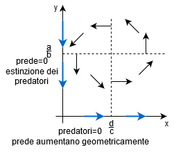

# Analisi II - sesta parte bis
### Teorema 5 (Principio di sovrapposizione)
Se $\underline{y}_1(\cdot)$ è soluzione di $\underline{y}'=\mathbb{A}(x)\underline{y}+B_1(x)$ e $\underline{y}_2(\cdot)$ è soluzione di $\underline{y}'=\mathbb{A}(x)\underline{y}+B_2(x)$ allora $\underline{y}(\cdot)=\underline{y}_1(\cdot)+\underline{y}_2(\cdot)$ è soluzione di $\underline{y}'=\mathbb{A}(x)\underline{y}+(B_1(x)+B_2(x))$ (conseguenza della linearità)
#### Problema
Come determinare la matrice risolvente?
+ SEDO del $I$ ordine autonomo
Sia $\mathbb{A}(\cdot)=\mathbb{A}$ una matrice $n\times n$ costante, cioè $\mathbb{A}\in M(n,n)$. Il SEDO (o) $\underline{y}'=\mathbb{A}\underline{y}$ Si dice SEDO lineare del $I$ ordine autonomo. 
### Osservazione 
$N=1$, $y'=ay$, $a\in \mathbb{R}$, $y(x)=c\cdot e^{ax}$
Si cercano soluzioni del tipo $\underline{y}(x)=e^{λx}+c$, con $x\in \mathbb{R}$, dove $λ\in \mathbb{R}$ (o $\mathbb{C}$) e $\underline{c}\in \mathbb{R}^n \neq \underline{0}$. Si impone che $\underline{y}(\cdot)$ sia soluzione di (o), cioè $λe^{λx}\cdot \underline{c}=\mathbb{A}(e^{λx}\underline{c})=e^{λx}\mathbb{A}\underline{c}$, $\forall x\in \mathbb{R}$ e quindi $\mathbb{A}\underline{c}=λ\underline{c}$, cioè $λ$ è autovalore di $\mathbb{A}$ e $\underline{c}$ è l'autovettore corrispondente.
Esiste una base di $\mathbb{R}^n$ (o $\mathbb{C}^n$) formata da autovettori? Cioè, esistono $n$ autovettori linearmente indipendenti?
Questo è vero se $\mathbb{A}$ è simmetrica o $\mathbb{A}$ ha $n$ autovalori distinti (e quindi..)
### Teorema
Se $\mathbb{A}$ ha $n$ autovettori linearmente indipendenti $\{\underline{u}_1,...,\underline{u}_n\}$ allora le funzioni $z_1(x)=e^{λ_1x}\underline{u}_1$,...,$z_n(x)=e^{λ_nx}\underline{u}_n$ formano una bse di $S_0$ e quindi $\mathbb{U}(x)=(\underbrace{e^{λ_1x}\cdot \underline{u}_1}_{colonna},...,\underbrace{e^{λ_nx}\cdot \underline{u}_n}_{colonna})$
#### Linea di massima discesa (o ascesa).
Dato un campo $f:A(\subseteq\mathbb{R}^n)\to\mathbb{R}$, di classe $C^1$ si dice linea di massima discesa per $\underline{x}^0\in A$ la curva $γ:I\to A$ t.c. $\begin{cases}γ'(t)=\underset{+}{-}\nabla f(γ(t))\\ γ(t^0)=\underline{x}^0 \end{cases}$ $t\in I$
## SEDO di ordine superiore
### EDO scalari del $II$ordine
Sia $f:E(\subseteq\mathbb{R}^3)\to\mathbb{R}$, l'EDO $y''(x)=f(x,y(x),y'(x))$ (o, sinteticamente, $y''=f(x,y,y')$) si dice EDO scalare del $II$ ordine
### Osservazione
Riduzione ad un SEDO del $I$ ordine:
Se si pone $y_1(x)=y(x)$ e $y_2(x)=y'(x)$ e $F(x,y_1,y_2)=\begin{pmatrix}y_2 \\f(x,y_1,y_2) \end{pmatrix}$ allora l'equazione differenziale scalare $y''(x)=f(x,y(x),y'(x))$ è equivalente al SEDO del $I$ ordine di dimensione $2$.
$\begin{cases}y'_1(x)=y_2(x)\\y'_2(x)=f(x,y_1(x),y_2(x)) \end{cases}$ $\Leftrightarrow$ $\begin{pmatrix}y_1(x)\\y_2(x) \end{pmatrix}'=F(x,y_1(x),y_2(x))$
+ Una funzione $y(\cdot):I(\subseteq\mathbb{R})\to \mathbb{R}$, con $I$ intervallo, si dice soluzione di $y''=f(x,y,y')$ se
1. $y(\cdot)$ è derivabile in $I$
2. $(x,y(x),y'(x))^T\in E$, $\forall x\in I$
3. $y''(x)=f(x,y(x),y'(x))$, $\forall x\in I
Siano $f:E(\subseteq\mathbb{R}^3)\to\mathbb{R}$ e $(x^0,y^0,\overset{=z^0}{v^0})^T\in E$. Il problema
$\begin{cases}y''=f(x,y,y')\\y(x^0)=y^0 \\ y'(x^0)=v^0\end{cases}$ si dice problema di Cauchy
+ Una funzione $y(\cdot):I(\subseteq\mathbb{R})\to \mathbb{R}$, si dice soluzione del (PC) se
1. $y(\cdot)$ è soluzione dell'equazione $y''=f(x,y,y')$
2. $x^0\in I$
3. $y(x^0)=y^0$, $y'(x^0)=v^0$
### Teorema di esistenza e unicità locali
Se $f:A(\subseteq\mathbb{R}^3)\to\mathbb{R}$, $A$ aperto, è continua e $(x^0,y^0,v^0)^T\in A$, allora esistono $h>0$ e una funzione $y(\cdot):]x_0-h,x_0+h[$ di classe $C^1$ soluzione del (PC) $\begin{cases}y''=f(x,y,y')\\y(x^0)=y^0 \\ y'(x^0)=v^0\end{cases}$. Se inoltre $\displaystyle\frac{\partial f}{\partial y}$ e $\displaystyle \frac{\partial f}{\partial z}$ sono continue allora tale soluzione è anche unica.
### Teorema di esistenza globale
Se $f:I\times\mathbb{R}^2\to \mathbb{R}$, $I$ intervallo aperto, è continua, $x^0\in I$ e $(y^0,v^0)\in \mathbb{R}^2$ e per ogni intervallo compatt $H\subseteq I$ esistono $α,β,γ\in \mathbb{R}$ t.c. $|f(x,y,z)|\le α|y|+β|z|+γ$, $\forall x\in H$ e $(y,z)^T\in \mathbb{R}^2$ allora esiste (almeno) una soluzione $y(\cdot)$ definita su $I$.
## Equazione di Newton autonoma e conservativa
Sia $f:J(\subseteq \mathbb{R})\to \mathbb{R}$, $J$ intervallo aperto, di classe $C^1$. L'EDO
$y''=f(y)$ si dice equazione di Newton autonoma ($f$ dipende da $y$) e conservativa, cioè senza dissipazione ($f$ __non__ dipende da $y'$).
Considerando il (PC) $\begin{cases}y''=f(y)\\y(x^0)=y^0 \\ y'(x^0)=v^0\end{cases}$, con $x^0\in \mathbb{R}$ ($f:\mathbb{R}\times J\times \mathbb{R})\to \mathbb{R}$
### Metodo risolutivo basato sulla conservazione dell'energia
Sia $y(\cdot):I(\subseteq \mathbb{R})\to J(\subseteq \mathbb{R})$ la soluzione del (PC). Moltiplicando l'EDO per $y'(\cdot)$ e integrando tra $x_0$ e $x$ si ottiene 
$\int_{x_0}^x \underbrace{y'(t)y''(t)}_{\Leftrightarrow \frac{d}{dt}\frac{1}{2}(y'(t))^2}dt=\int_{x_0}^x \underbrace{f(y(t))y'(t)}_{\frac{d}{dt}F(y(t))}dt$, dove $F'=f$
$\frac{1}{2}(y'(t))^2-\frac{1}{2}(y'(x_0))^2=F(y(x))-F(y(x_0))$ in $I$, con $F'=f$. Quindi si ha
$\displaystyle \underbrace{\underbrace{\frac{1}{2}y'(x)^2}_{\text{Energia cinetica}}-\underbrace{F(y(x))}_{\text{Energia potenziale}}}_{\text{Energia meccanica}}=\frac{1}{2}v_0^2-F(y_0)$, in $I$.
L'energia si conserva nel tempo
Ponendo $E(y,v)=\frac{1}{2}v^2-F(y)$, per $y\in J$, $v\in \mathbb{R}$, si ha che la coppia $(y(\cdot),y'(\cdot))^T$ parametrizza l'insieme di livello della funzione energia, $E:(y(x),y'(x))^T\in L_{\frac{1}{2}{v_0}^2-F(y_0)}(E)$
Supponendo che $\forall x\in I$, $y'(x)^2=2F(y(x))+(v_0^2-2F(y_0))$
Allora in un intorno di $x_0$ si ha:
$v_0>0$: $\begin{cases}y'(\cdot)=\sqrt{2F(y(\cdot ))+(v_0^2-2F(y_0))}\\y(x_0)=y_0 \end{cases}$
$v_0<0$: $\begin{cases}y'(\cdot)=-\sqrt{2F(y(\cdot ))+(v_0^2-2F(y_0))}\\y(x_0)=y_0 \end{cases}$
Se invece $v_0=0$
$\begin{cases}f(y_0)>0: y'(\cdot)=sign(x-x_0)\cdot \sqrt{2F(y(\cdot ))+(v_0^2-2F(y_0))}\\f(y_0)<0: y'(\cdot)=-sign(x-x_0)\cdot \sqrt{2F(y(\cdot ))+(v_0^2-2F(y_0))} \\ f(y_0)=0: y'(\cdot)=y_0\end{cases}$
### EDO scalari del $II$ ordine con coefficienti costanti
Siano $a,b\in \mathbb{R}$ e $c(\cdot):I\to \mathbb{R}$, $I$ intervallo aperto, continua.
L'EDO (c) $y''+ay'+by=c(x)$ si dice EDO scalare del $II$ ordine con coefficienti costanti completa
L'EDO (c) $y''+ay'+by=0$ si dice EDO scalare del $II$ ordine con coefficienti costanti omogenea
#### Motivazioni
+ Vibrazioni meccaniche
+ Circuiti
### Teorema 0
Per ogni $(x_0,y_0,z_0)^T\in I\times \mathbb{R}^2$, il (PC) $\begin{cases}y''+ay'+by=c(x)\\y(x_0)=y_0 \\ y'(x_0)=v_0 \end{cases}$ ha una ed una sola soluzione $y(\cdot)$ definita su $I$.
### Definizione
$L:C^2(I)\to C^0(I)$, ponendo $L(y(\cdot))=y''(\cdot)+ay^2(\cdot)+by(\cdot)$
### Teorema 1
$L$ è un'applicazione lineare. Si ha
+ (c) $\Leftrightarrow L(y(\cdot))=c(\cdot)\Leftrightarrow y(\cdot)\in L^{-1}(\{c(\cdot)\})=S_c$
+ (o) $\Leftrightarrow L(y(\cdot))=0\Leftrightarrow y(\cdot)\in L^{-1}(\{0\})=S_0=KerL$
### Teorema 2 (struttura di $S_c$)
L'insieme $S_c$ è costituito da tutte e sole le funzioni $y(\cdot)=\overline{y}(\cdot)+z(\cdot)$, con $\overline{y}(\cdot)$ soluzione particolare di (c) e $z(\cdot)$ soluzione generica di (o), cioè $S_c=\overline{y}(\cdot)+KerL$
### Osservazione
l'EDO $y''+ay'+by=c(\cdot)$ è equivalente al SEDO $\begin{cases}y'_1=y_2\\ y'_2=-ay_2-by_1+c(x)\end{cases}$, dove si è posto $y_1=y(\cdot)$ e $y_2(\cdot)=y'(\cdot)$
### Teorema 3a
$S_0=KerL$ è uno spazio vettoriale di dimensione $2$.
### Dimostrazione
Segue direttamente dall'equivalenza di EDO e SEDO
### Teorema 3b - Idea
Si cerca una soluzione di (o) del tipo $z(x)=e^{λx}$, $λ\in\mathbb{C}$. Imponendo che sia soluzione si ottiene
$z''(x)+az'(x)+bz(x)=λ^2e^{λx}+aλe^{λx}+be^{λx}=0$ 
### Osservazione
$λ=α+βi\in \mathbb{C}$, $e^{λx}=e^{αx}(cosβx+isinβx)(\leftarrow$ formula di Eulero), $\forall x\in \mathbb{R}.
Il che equivale a richiedere che $λ^2+aλ+b=0$.
### Equazione caratteristica
(k) $λ^2+aλ+b=0$
### Teorema 3b
Si ha:
1. Se $\Delta=a^2-4b>0$, allora dette $λ_1,λ_2\in \mathbb{R}$ ($λ_1\neq λ_2$), le radici di (k), $\{e^{λ_1x},e^{λ_2x}\}$ è una base di $S_0$
2. Se $\Delta=a^2-4b<0$, dette $λ_1=α+iβ$, $λ_2=α-iβ$ con $β\neq 0$ le radici di (k), allora $\{e^{αx}cos(βx),e^{αx}sin(βx)\}$ è una base di $S_0$
3. Se $\Delta=a^2-4b=0$, detta $λ_0\in \mathbb{R}$ l'unica radice di (k), allora $\{e^{λ_0x},xe^{λ_0x}\}$ forma una base di $S_0$
### Osservazione
Siano $λ_1,λ_2\in \mathbb{R}$ soluzioni di (k), con $λ_1\neq λ_2$, allora $e^{λ_1x}$ e $\displaystyle \frac{e^{λ_1x}-e^{λ_2x}}{λ_1-λ_2}$ sono soluzioni di (o)
Se $λ_2\to λ_1$, allora $\displaystyle \frac{e^{λ_1x}-e^{λ_2x}}{λ_1-λ_2}=e^{λ_1x}\cdot \frac{1-{e^{-(λ_1-λ_2)x}}}{λ_1-λ_2}=e^{λ_1x}=\left(\frac{e^{-(λ_1-λ_2)x}}{-(λ_1-λ_2)x}\right)x\to e^{λ_1x}x$, se $t=-(λ_1-λ_2)\to 0$, $\frac{e^{t-1}}{t}\to 1$
### Dimostrazione teorema 3b
Dal teorema  3a segue che $dimS_0=2$. Quindi basta verificare che le funzioni considerate sono linearmente indipendenti.
+ Caso (1)  
  Siano $c_1,c_2\in \mathbb{R}$ t.c. $c_1e^{λ_1x}+c_2e^{λ_2x}=0$, $\forall x\in \mathbb{R}$. Derivando si ottiene $λ_1c_1e^{λ_1x}+λ_2c_2e^{λ_2x}=0$, $\forall x\in \mathbb{R}$
  Valutando in $x=0$, si ha:
  $\begin{cases}c_1+c_2=0\\ λ_1c_1+λ_2c_2=0\end{cases}$,  $det\begin{pmatrix}1 & 1\\ λ_1 & λ_1\end{pmatrix}=λ_2-λ_1\neq 0$
  Quindi $c_1=c_2=0$.

Analogamente di procede su (2) e (3)
### Teorema 4 (determinazione di una soluzione particolare)
Una soluzione particolare di (c) è data da
$\overline{y}(x)=\int_{x_0}^xG(x,t)x(t)dt$, $x_0\in I\leftarrow$ Green
$G(x,t)=\displaystyle\frac{det\begin{pmatrix}z_1(0) & z_2(0)\\ z_1(x-t) & z_2(x-t)\end{pmatrix}}{det\begin{pmatrix}z_1(0) & z_2(0)\\ z'_1(0) & z'_2(0)\end{pmatrix}}$, $((x,t)^T\in \mathbb{R}^2)$
dove $\{z_1(\cdot),z_2(\cdot)\}$ è base di $S_0$
#### NB
$y'=ay$, $a\in \mathbb{R}$, $G(x,t)=e^{ax}x^{-at}=e^{a(x-t)}$
### Metodo di somiglianza
Sia $c(x)=P(x)e^{λx}$, $P\in \mathbb{R}[x]$ e $λ\in \mathbb{R}$. Si cerca una soluzione particolare di (c) del tipo $\overline{y}(x)=Q(x)e^{λx}\in \mathbb{R}[x]$
1. Se $λ\in \mathbb{R}$ __non__ è radice di (k), allora $degQ=degP$
2. se $λ\in \mathbb{R}$ è radice di (k) di molteplicità $\nu\in \{1,2\}$, allora $Q(x)=x^\nu R(x)$, con $R\in \mathbb{R}[x]$ e $degR=degQ$

Sia $c(x)=P(x)e^{αx}cosβx$ (o $P(x)e^{αx}sinβx$) con $P\in \mathbb{R}[x]$ e $α,β\in \mathbb{R}$, $β\neq 0$. Si cerca una soluzione particolare di (c) del tipo $\overline{y}(x)=Q_1(x)e^{αx}cos(βx)+Q_2(x)e^{αx}sin(βx)$, con $Q_1,Q_2\in \mathbb{R}[x]$
1. Se $α+iβ\in \mathbb{C}$ __non__ è radice di (k) allora $degQ_1=degP$
2. SE $α+iβ\in \mathbb{C}$ è radice di (k) (necessariamente di molteplicità $1$), allora $Q_1(x)=xR_1(x)$ e $Q_2(x)=xR_2(x)$, con $R_1,R_2\in \mathbb{R}[x]$ e $degR_1=degR_2=degP$
### Teorema 5 (principio di sovrapposizione)
Sia $y_1(\cdot)$ soluzione di $y''+ay'+by=c_1(x)$ e sia $y_2(\cdot)$ soluzione di $y''+ay'+by=c_2(x)$, allora $y(\cdot)=y_1(\cdot)+y_2(\cdot)$ è soluzione di $y''+ay'+by=(c_1(x)+c_(x))$
### Dimostrazione
Segue dalla linerarità di $L$
### Metodo risolutivo
Sia $(x(\cdot),y(\cdot))$ una soluzione che risulta essere di classe $C^2$, si hanno due casi:
1. $b\cdot c=0$
Sia, per esempio, $b=0$. Si ha
$\begin{cases}x'(t)=ax(t)+f(t)\text{   equazione disaccoppiata da }y\\y'(t)=cy(t)+(cx(t)+g(t)) \end{cases}$
Risolvo $x(t)$ e la metto nella seconda riga che mi ritorna un'equazione risolvibile
Si risolve la $I$ equazione e si inserisce la soluzione $x(\cdot)$ nella $II$ equazione. La coppia così costruita è la soluzione generale del sistema.
2. $b\cdot c\neq 0$
(s) $\begin{cases}x'(t)=ax(t)+by(t)+f(t)\\ y'(t)=cx(t)+dy(t)+g(t)\end{cases}$, equazione accoppiata.
Si deriva, per esempio, la $I$ equazione, si ottiene: $x''(t)=ax'(t)+by'(t)+f'(t)=ax'(t)+bcx(t)+d(x'(t)-ax(t)-f(t))+bg(t)+f'(t)$ e quindi 
(E): $x''(t)-\underbrace{(a+d)}_{tx(\mathbb{A})=\sum_i a_{ii}}x'(t)+(\underbrace{ad-bc}_{det(\mathbb{A})})x(t)=bg(t)-df(t)-f'(t)$.
Sia $x(\cdot)$ la soluzione generale di (E), si ha
$y(\cdot)=\displaystyle \frac{1}{b}(x'(\cdot )-ax(\cdot)-f(\cdot))$. La coppia $(x(\cdot),y(\cdot))$ è la soluzione generale di (S)
### Sistema di Lotka-Volterra
1. Senza prelievo esterno
$\begin{cases}x'=ax-bxy\\y'=cxy-dy \end{cases}$, dove $\begin{aligned}x=x(t)\text{ numero di prede al tempo }t\text{    }\\y=y(t)\text{ numero di predatori al tempo }t \end{aligned}$
con $a,b,c,d\in \mathbb{R}^+$
Si cerca $γ(t):I\to \mathbb{R}^2$, $γ(t)=(x(t),y(t))^T$, t.c. posto $g:\mathbb{R}^2\to \mathbb{R}^2$, $g(x,y)=(ax-bxy,cxy-dy)^T$
$γ'(t)=g(γ(t))$, $γ$ linea di campo del campo vettoriale $g$.
$\displaystyle g(\frac{d}{c},\frac{a}{b})=\underline{0}$, il punto $\displaystyle (\frac{d}{c},\frac{a}{b})$ è un equilbrio, cioè è una soluzione costante del sistema, le traiettorie "circolano" vicino al punto di equilibrio

$\begin{cases}\displaystyle x\frac{x'}{y}=\frac{a}{y}-b /\cdot -y'\\ x\frac{y'}{y}=c-\frac{d}{y} /\cdot +x'\end{cases}$; sommando le due equazione si ottiene:
$\displaystyle 0=\frac{a}{y}y'-by'-\frac{d}{x}x'+cx'$
$\displaystyle 0=\frac{d}{dt}(-alogy+by-dlogy+cx)$, quindi $-alog(y(\cdot))-dlog(x(\cdot))+cx(\cdot)+dy(\cdot)=K$.
Ponendo $f(x,y)=-dlogx-alogy+cx+by$ si ha che $y(\cdot)$ parametrizza una linea di livello di $f$:
$\displaystyle L_k(f)=\{(x,y)^T:f(x,y)=K\}$, $\nabla f(x,y)=(-\frac{d}{x}+c,-\frac{a}{y}+b)^T=\underline{0}\Leftrightarrow (x,y)^T=(\frac{d}{c},\frac{a}{b})^T$
$Hf(x,y)=\displaystyle \begin{pmatrix}\frac{d}{x^2} & 0\\0 & \frac{a}{y^2} \end{pmatrix}$, $Hf(x,y)$ è definita positiva, quindi $(\frac{d}{c},\frac{a}{b})^T$ è un punto di minimo.
Poichè $f$ è "coerciva", nel $I$ quadrante, $(\frac{d}{c},\frac{a}{b})^T$ è il punto di minimo assoluto per $f$.
Le linee di livello di $f$ sono curve chiuse e quindi $x(\cdot)$ e $y(\cdot)$ sono funzioni $T$-periodiche per qualche $T>0$ (che dipende dalla funzione $y(\cdot)$).
Si ha $\int_{0}^T \displaystyle\frac{x'(t)}{x(t)}dt=\int_0^T (a-by(t))dt\Leftrightarrow log(x(T))-log(x(0))=0=\int_{0}^T adt-b\int_{0}^T y(t)dt=0 /\cdot \frac{b}{T}$
$\Rightarrow\displaystyle \frac{1}{T}\int_{0}^Ty(t)dt=\frac{a}{b}$ e
$\displaystyle \int_0^T \frac{y'(t)}{y(t)}dt=\int_{0}^{T} (cx(t)-d)dt\Rightarrow\displaystyle \frac{1}{T}\int_{0}^Tx(t)dt=\frac{d}{c}$
Le due medie integrali sono il numero medio di individui (prede/predatori) su un periodo $T$
2. Con prelievo esterno (pesca selettiva)
$\begin{cases}x'=ax-bxy-ε_{1}x\\y'=cxy-dy-ε_2y \end{cases}$, con $0<ε_1<a$ e $ε_2>0$
$\begin{cases}x'=(a-ε_1)x-bxy\\y'=cxy-(d+ε_2)y) \end{cases}$
Il nuovo equilibrio si trova in $\displaystyle \left(\frac{d+ε_2}{c},\frac{a-ε_1}{b}\right)$
Paradosso: si ha $\displaystyle \begin{cases}\displaystyle \frac{1}{T}\int_{0}^T x(t)dt=\frac{d+ε_2}{c}\to \text{aumento delle prede}\\ \displaystyle \frac{1}{T}\int_{0}^T ys(t)dt=\frac{a-ε_1}{b}\to \text{diminuzione dei predatori} \end{cases}$

$\overline{g}(x,y)=g(\frac{d}{c},\frac{a}{b})+Jg(\frac{d}{c},\frac{a}{b})\begin{pmatrix}x+\frac{d}{c}\\ y-\frac{a}{b}\end{pmatrix}\to$ Sistema linearizzato
$γ'(t)=\overline{g}(γ(t))$

