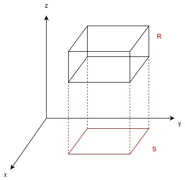
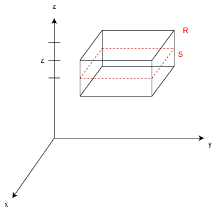
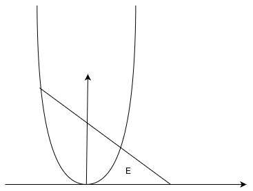
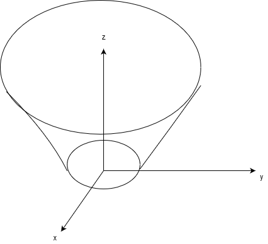

# Analisi II - settima parte
## Integrazione
### Integrazione secondo Riemann in $\mathbb{R}^n$ ($N=2,3$)
### Integrazione secondo Riemann su rettangoli in $\mathbb{R}^2$
Sia $R=[a_1,b_1]\times [a_2,b_2]$ un rettangolo in $\mathbb{R}^2$
#### Decomposizione di $R$
Siano:
+ $a_1<x_0<x_1<...<x_n=b_1$ $n+1$ punti di $[a_1,b_1]$
+ $a_2<y_0<y_1<...<y_m=b_2$ $m+1$ punti di $[a_2,b_2]$
Per $i=1,...,n$ e $j=1,...,m$ si pone $R_{ij}=[x_{i-1},x_i]\times [y_{j-1},y_j]$. La collezione di tutti i rettangoli si indica con $δ$, $δ=\{R_{ij}:i=1,...,n,j=1,...,m\}$, si dice decomposizione di $R$
#### Insieme delle decomposizioni di $R$
Sia $f$ una funzione __limitata__, $-\infty<l=\underset{R}{inf}f\le L=\underset{R}{sup}f<+\infty$.
Si pone $\Delta(R)=\{δ:δ\text{ è decomposizione di }R\}\leftarrow$ è l'insieme delle decomposizioni.
### Somme inferiori e somme superiori
Sia una $δ\in \Delta(R)$
$\sum_{j=1}^m\sum_{i=1}^n l_{ij}\cdot m_2(R_{ij}=s(δ,f)\to$ __Somma inferiore__,
$l_{ij}=\underset{R-{ij}}{inf}f\to$ altezza, misurata fino al minimo della funzione in quell'area
$m_2(R_{ij})=(x_i-x_{i-1})(y_j-y_{j-1})\to A_{\text{base}}$, $\forall i=1,...,n,j=1,...,m$
$l_{ij}\cdot m_2$ è dunque il volume inscritto nella figura solida, delimitata dal valore minimo della funzione e dal piano $xy$
$\sum_{j=1}^m\sum_{i=1}^n L_{ij}\cdot m_2(R_{ij}=\mathbb{S}(δ,f)\to$ __Somma superiore__,
$L_{ij}=\underset{R-{ij}}{sup}f\to$ altezza, misurata fino al massimo della funzione in quell'area
$m_2(R_{ij})=(x_i-x_{i-1})(y_j-y_{j-1})\to A_{\text{base}}$, $\forall i=1,...,n,j=1,...,m$
$L_{ij}\cdot m_2$ è dunque il volume del parallelpipedo circoscritto alla figura solida, delimitata dal valore massimo della funzione e dal piano $xy$
### Proposizione
$\forall δ_1,δ_2\in \Delta(R)$, si ha $\mathbb{s}(δ_1,f)\le \mathbb{S}(δ_2,f)$
#### Conseguenza
Le classi
$σ(f)=\{s(δ,f):δ\in \Delta(R)\}$ e
$\Sigma(f)=\{\mathbb{S}(δ,f):δ\in \Delta(R)\}$ sono classi separate
### Integrale secondo Riemann su un rettagolo in $\mathbb{R}^2$
Se $σ(f)$ e $\Sigma(f)$ sono classi contigue, cioè $supσ(f)=inf\Sigma(f)$, allora si dice che $f$ è integrabile su $R$ e si pone $\int\int_Rf(x,y)dxdy=supσ(f)=inf\Sigma(f)$
#### Significato geometrico
Sia $f:R(\subseteq\mathbb{R}^2)\to\mathbb{R}$, integrabile su $R$ e $f(x,y)>0$ in $R$.
Si pone $T=\{(x,y,z)^T\in R, 0<z\le f(x,y)\}$. Si ha $m_3(T)=\int\int_Rf(x,y)dxdy$
### Integrazione secondo Riemann su un parallelepipedo in $\mathbb{R}^3$
+ Sia $R=[a_1,b_1]\times [a_2,b_2]\times  [a_3,b_3]$
#### Decomposizione di R
+ $a_1<x_0<x_1<...<x_n=b_1$ $n+1$ punti di $[a_1,b_1]$
+ $a_2<y_0<y_1<...<y_m=b_2$ $m+1$ punti di $[a_2,b_2]$
+ $a_3<z_0<z_1<...<z_m=b_3$ $l+1$ punti di $[a_3,b_3]$
Per $i=1,..,.n$, $j=1,...,m$, $k=1,...,l$.
La collezione $δ=\{R_{ijk}:i=1,..,.n, j=1,...,m, k=1,...,l\}$ si dice decomposizione di $R$.
$\Delta(R)$ è l'insieme di tutte le composizioni di $R$
### Somme inferiori e somme superiori
Sia $δ$ una decomposizione di $R$, $δ\in \Delta(R)$, si pone
$\displaystyle\sum_{k=1}^l\sum{j=1}^m\sum_{i=1}^n l_{ijk}m_3(R_{ijk})=s(δ,f)$
$\displaystyle\sum_{k=1}^l\sum{j=1}^m\sum_{i=1}^n L_{ijk}m_3(R_{ijk})=S(δ,f)$
dove $l_{ijk}=\underset{R_{ijk}}{inf}f\le L_{ijk}=\underset{R_{ijk}}{sup}f$ e $m_3(R_{ijk})=(x_i-x_{i-1})(y_j-y_{j-1})(z_k-z_{k-1})$, per $i=1,..,.n$, $j=1,...,m$, $k=1,...,l$.
### Proposizione
$\forall δ_1,δ_2\in \Delta(R)$ si ha $s(δ_1,f)\le S(δ_2,f)$
#### Conseguenza
Le classi
$σ(f)=\{s(δ,f):δ\in \Delta(R)\}$ e
$\Sigma(f)=\{\mathbb{S}(δ,f):δ\in \Delta(R)\}$ sono classi separate
### Integrale secondo Riemann su un parallelepipedo su $R$
Se $σ(f)$ e $\Sigma(f)$ sono contigue, cioè $supσ(f)=inf\Sigma(f)$, allora si dice che $f$ è integrabile su $R$ e si pone $\iiint_R f(x,y,z)dxdydz=supσ(f)=inf\Sigma(f)$

### Rettangoli $n$-dimensionali ("$n$-rettangoli") e integrazione su $n$-rettangoli
Se $n=1$, allora $R=[a,b]\subseteq \mathbb{R}$ è un rettangolo $1$-dimensionale, "$1$-rettangolo"
Se $n=2$, allora $R=[a_1,b_1]\times[a_2,b_2]\subseteq \mathbb{R}^2$ è un rettangolo $2$-dimensionale, "$2$-rettangolo"
...
In generale $R=[a_1,b_1]\times [a_2,b_2]\times\dots\times [a_n,b_n]\subseteq \mathbb{R}^n$ è un rettangolo $n$-dimensionale, "$n$-rettangolo"
La stessa costruzione fatta in precedenza permette di definire l'integrale di $f:R(\subseteq \mathbb{R}^n)\to \mathbb{R}$, con $R$ rettangolo limitato, si indica con $\int_Rf$
### Condizioni di integrabilità
Se $f:R(\subseteq\mathbb{R}^n)\to\mathbb{R}$, $R$ $n$-rettangolo, continua, allora $f$ è integrabile su $R$
### Formula di riduzione
#### Problema
Come calcolare un integrale doppio o un integrale triplo?
+ $n=1$ se $f:R=[a,b](\subseteq \mathbb{R})\to \mathbb{R}$ è continua allora $\int_{a}^b f(x)dx=F(b)-F(a)$, per il teorema di Torricelli, con $F'=f$ in $R$
+ $n\ge 2$ si cerca di ridurre l'integrale doppio (triplo) a due (tre) successive integrazioni unidimensionali
#### Formule di riduzione per integrali doppi su rettangoli
##### Teorema di Fubini
Se $f:R=[a,b]\times [c,d](\subseteq\mathbb{R}^2)\to\mathbb{R}$, è integrabile su $R$ e, per ogni $\overline{x}\in[a,b]$ $f(\overline{x},\cdot):[c,d]\to \mathbb{R}$ ($x$ fissato, $y$ libero), è integrabile su $[c,d]$, allora, posto $g(x)=\int_{c}^df(x,y)dy$, si ha che $g:[a,b]\to \mathbb{R}$ è integrabile, $\int_{a}^bg(x)dx=\iint_Rf(x,y)dxdy$, cioè $\underbrace{\int_a^b(\int_c^df(x,y)dy)dx}_{\text{integrale iterato}}=\underbrace{\iint_Rf(x,y)dxdy}_{\text{integrale doppio}}$, dove l'integrale doppio si ricava dalle somme inferiori e superiori
##### NB
Vale il risultato analogo in cui $x$ e $y$ si scambiano i ruoli nel teorema di Fubini:
Se $f:R=[a,b]\times [c,d](\subseteq\mathbb{R}^2)\to\mathbb{R}$, integrabile su $R$ e $\forall \overline{y}\in [c,d]$ la funzione $f(\cdot ,\overline{y}):[a,b]\to \mathbb{R}$ è integrabile su $[a,b]$, allora, posto $h(y)=\int_a^bf(x,y)dx$, la funzione $h:[c,d]\to \mathbb{R}$ è integrabile su $[c,d]$ e $\int_c^d h(y)dy=\iint_Rf(x,y)dxdy$ cioè $\int_c^d(f(x,y)dx)dy=\iint_Rf(x,y)dxdy$
##### Osservazione
Se $f:R\to\mathbb{R}$, è continua allora valgono entrambe le versioni del teorema  di Fubini
#### Formule di riduzione per integrazione su parallelepipedi rettangoli in $\mathbb{R}^3$
Due strade percorribili:
1. Integrazione per corda
  
1. Integrazione per corda
  

#### Riduzioni per corde
##### Teorema di Fubini
Se $f:R=[a_1,b_1]\times [a_2,b_2]\times[a_3,b_3]\to\mathbb{R}$, integrabile su $R$ e, $\forall (\overline{x},\overline{y})\in S=[a_1,b_1]\times [a_2,b_2]$ la funzione $f((\overline{x},\overline{y},\cdot$ è integrabile su $[a_3,b_3]$, allora posto $g(x,y)=\int_{a_3}^{b_3}f(x,y,z)dz$, la funzione $g:S\to \mathbb{R}$ è integrabile su $S$ e $\iint_Sg(x,y)dxdy=\iiint_Rf(x,y,x)dxdydz$, cioè $\iint_S(\int_{a_3}^{b_3}f(x,y,z)dz)dxdy=\iiint_Rf(x,y,z)dxdydz$
Valgono analoghi gli altri risultati in cui le variabili si scambiano i ruoli
#### Riduzione per sezione
##### Teorema di Fubini
Sia $f:R=[a_1,b_1]\times [a_2,b_2]\times[a_3,b_3]\to\mathbb{R}$, integrabile su $R$. $\forall \overline{z}\in [a_3,b_3]$ la funzione $f(\cdot ,\overline{z})$ è integrabile su $S=[a_1,b_1]\times [a_2,b_2]$, allora posto $h(z)=\\int_Sf(x,y,z)dxdy$, la funazione $h:[a_3,b_3]\to \mathbb{R}$ è integrabile su $[a_3,b_3]$ e $\int_{a_3}^{b_3}h(z)dz=\iiint_R f(x,y,z)dxdydz$, cioè $\int_{a_3}^{b_3}(\iint_Sf(x,y,z)dxdy)dz)=\iiint_Rf(x,y,z)dxdydz$.
Valgono analoghi gli altri risultati in cui le variabili si scambiano i ruoli
### Proprietà dell'integrale su $n$-rettangoli
Sia $R(\subseteq\mathbb{R}^n)$ un $n$-rettangolo e si ponga $\mathscr{R}(R)=\{f_R\to \mathbb{R}$, $f$ integrabile su $R\}$.
+ Linearità
Se $f,g\in \mathscr{R}(R)$ e $α,β\in \mathbb{R}$, allora $αf+βg\in \mathscr{R}(R)$ e $\int_R(αf+βg)=α\int_Rf+β\int_Rg$
#### NB
$\mathscr{R}(R)$ è uno spazio vettoriale e l'integrale è un'applicazione lineare
+ Monotonia
Se $f,g\in \mathscr{R}(R)$ e $f(\underline{x})\le g(\underline{x})$ $\forall \underline{x}\in R$, allora $\int_Rf\le \int_Rg$
### Integrale del prodotto
Se $f,g\in \mathscr{R}(R)$, allora $f\cdot g\in \mathscr{R}(R)$
### Integrale del valore assoluto
Se $f\in \mathscr{R}(R)$, allora $|f|\in \mathscr{R}$ e $|\int_Rf|\le \int_R|f|$
### Proprietà della media
Se $f\in \mathscr{R}(R)$, allora 
$\displaystyle \underset{R}{inf}f=l<\frac{\int_Rf}{m_n(R)}<L=\underset{R}{sup}f$
Inoltre se $f$ è continua, allora esiste $\underline{x}^0\in R$ t.c. $\displaystyle \underbrace{f(\underline{x}^0)}_{Valor medio}=\underbrace{\frac{\int_Rf}{m_n(R)}}_{media integrale}$
### Integrale della restrizione
Se $f\in \mathscr{R}(R)$ e $R'\subseteq R$ è un $n$-rettangolo allora $f_{|_{R'}}\in \mathscr{R}(R')$
### Additività rispetto al dominio
Se $R,R',R''$ sono $n$-rettangoli tali che $R'\cup R''=R$ e $int(R')\cap int(R'')=\emptyset$ e $f:R\to \mathbb{R}$ t.c. $f_{|_{R'}}\in \mathscr{R}(R')$ e $f_{|_{R''}}\in \mathscr{R}(R'')$ allora $f\in \mathscr{R}(R)$ e $\int_Rf=\int_{R'}f+\int_{R''}f$
### Insufficienza della teoria dell'integrazione su $n$-rettangoli
Come definire l'area di $E$?
$E=\{(x,y)^T:0<y<x^2 \wedge y\le 1-x\}$

Come calcolare il volume di $E$?
$E=\{(x,y,z)^T:x^2+y^2\le 1+z^2, 0\le z\le 4\}$

### Integrazione di funzione limitate su insiemi limitati
Sia $E(\subseteq \mathbb{R}^n)$, un insieme limitato e sia $f:E\to \mathbb{R}$ una funzione limitata.
Sia $R$ un $n$-rettangolo t.c. $E\subseteq R$
Si ponga $f:0:R\to \mathbb{R}$ con $f_0(\underline{x})f_0(\underline{x})=\begin{cases}f(\underline{x}), \underline{x}\in E\\x, \underline{x}\in R\setminus E \end{cases}$
Si dice che $f$ è integrabile su $E$ se la funzione $f_0$ è integrabile su $R$ e si pone $\displaystyle \int_{E}f=\int_Rf_0$
### Osservazione
La definizione non dipende da particolare $n$-rettangolo $R$ con $E\subseteq R$
#### Problema
In generale, anche se $f$ è continua in $E$ $f_0$ può essere discontinua su $R$.
Come stabilire, allora l'integrabilità di $f_0$ su $R$?
Bisogna trarre condizioni più generali della continuità che garantiscano l'integrabilità su $n$-rettangoli
### Teoria della misura secondo Peano-Jordan
#### Insieme misurabile
Sia $E\subseteq  \mathbb{R}^n$ un insieme limitato, si dice che $E$ è misurabile (secondo P-J) in $\mathbb{R}^n$ se la funzione $1$ è integrabile su $E$ e si pone $m_n=\int_E1$
### Osservazione
Funzione caratteristica di un insieme:
Sia $E(\subseteq  \mathbb{R}^n)$ la funzione $\Chi_E:\mathbb{R}^n\to \mathbb{R}$ definita da $\Chi_E(\underline{x})=\begin{cases}1, \underline{x}\in E\\ \underline{x}\notin E \end{cases}$. Si dice funzione caratteristica di $E$
### Osservazione
Un insieme $E(\subseteq  \mathbb{R}^n)$ limitato è misurabile se e solo se $\Chi(E)$ è integrabilie su un $n$-rettangolo $R\supseteq E$
### Definizione
$\mathscr{M}(\mathbb{R}^n)=\{E\subseteq \mathbb{R}^n:E$ è misurabile in $\mathbb{R}^n\}$ e $m_n:\mathscr{M}(\mathbb{R}^n)\to \mathbb{R}$, con $m_n(E)=\int_E1$
### Proprietà della misura
1. Se $A,B\in \mathscr{M}(\mathbb{R}^n)$, allora $A\cap B,A\cup B, A\setminus B\in \mathscr{M}(\mathbb{R}^n)$
  + Dimostrazione. Poichè $A,B\in \mathscr{M}(\mathbb{R}^n)$, $\mathcal{X}_A$, $\mathcal{X}_B$ sono integrabili in $R$. Si ha: $\mathcal{X}_{A\cap B}=\mathcal{X}_A\cdot \mathcal{X}_B$, che è integrabile in $R$.
  Si ha $\displaystyle \mathcal{X}_{A\cup B}=\mathcal{X}_A+\mathcal{X}_B-\mathcal{X}_{A\cap B}$ che è integrabile su $R$ e inoltre $\displaystyle \int_R \mathcal{X}_{A\cup B}=\int_R\mathcal{X}_A+\int_R\mathcal{X}_B-\int_R\mathcal{X}_{A\cap B}$. quindi $m_n(A\cup B)=m_n(A)+m_n(B)-m_n(A\cap B)$.
  Si ha $\displaystyle \mathcal{X}_{A\setminus B}=\mathcal{X}_A-\mathcal{X}_{A\cap B}$ e $\displaystyle \int_R\mathcal{X}_{A\setminus B}=\int_R\mathcal{X}_A-\int_R\mathcal{X}_{A\cap B}$, $m_n(A\setminus B)=m_n(A)-m_n(A\cap B)$
2. Se $A,B\in \mathscr{M}(\mathbb{R}^n)$ e $A\subseteq B$. aòòpra $m_n(A)\le m_n(B)$.
  + Dimostrazione. Se $A\subseteq B$, allora $\forall \underline{x}\in R$ si ha $\mathcal{X}_1(\underline{x})\le \mathcal{X}_2(\underline{x})$ e quindi $\int_R\mathcal{X}_A\le \int_R\mathcal{X}_B$
### Insieme di misura nulla o insieme trascurabile
Sia $T(\subseteq \mathbb{R}^n)$ limitato. Si dice che $T$ è __trascurabile in__ $\mathbb{R}^n$ (o di misura nulla) se $m_N(T)=0$
### Proposizione (caratteristica dell'insieme trascurabile)
Sia $T\subseteq \mathbb{R}^n$. Si ha che $T$ è trascurabile in $\mathbb{R}^n$ se e solo se $\forall ε>0\exists R_1,..,R_k$ $n$-rettangoli tali che $\displaystyle T\subseteq \bigcup_{i=1}^kR_i$ e $\displaystyle\sum_{i=1}^km_n(R_i)<ε$
### Proprietà
1. Se $T=\{\underline{x}^0\}\subseteq \mathbb{R}^n$, allora $m_n(T)=0$, $\forall n\ge 1$
2. Se $T=\{\underline{x}^1,...,\underline{x}^n\}\subseteq \mathbb{R}^n$, allora $m_n(T)=0$ $\forall n\ge 1$
3. Se $T\subseteq \mathbb{R}^n$ è un $1$-rettangolo, allora $m_n(T)=0$ $\forall n\ge 2$
4. Se $T\subseteq \mathbb{R}^n$ è un $2$-rettangolo, allora $m_n(T)=0$ $\forall n\ge 3$
5. Se $φ:R(\subseteq \mathbb{R}^n)\to \mathbb{R}$ è integrabile sul $n$-rettangolo $R$, allora $G(φ)=\{(\underline{x},φ(\underline{x}):\underline{x}\in R\}\subseteq \mathbb{R}^n$
  + Dimostrazione. Caso $n=1$. Poichè $φ:R=[a,b]\to \mathbb{R}$ è integrabile $sup s(δ,φ)=infS(δ,φ)$. Fissato $ε>0$, Esiste $δ\in \Delta(R)$ t.c. $ε>S(δ)-s(δ)=\sum_{i=1}^k L_i(x_i-x_{i-1})-\sum_{i=1}^k l_i(x_i-x_{i-1})$. $R_i=[x_{i-1},x_i]\times [l_i,L_i]$, per $i=1,...,k$, t.c. $G(φ)=R_1\cup R_2\cup ...R_k$

### Condizione di integrabilità su $n$-rettangoli
#### Teorema
Se $f:R(\subseteq \mathbb{R}^n)\to \mathbb{R}$, $R$ $n$-rettangolo, è limitata e continua su $R\setminus T$, con $m_n(T)=0$, allora $f$ è integrabile su $R$.
#### Teorema (caratterizzazione degli insiemi misurabili in $\mathbb{R}^n$)
Sia $E\subseteq \mathbb{R}^n$ un insieme limitato. Si ha che $E$ è misurabile in $\mathbb{R}^n$ se e solo se $m_n(frE)=0$
#### Dimostrazione
Proviamo solo che se $m_n(frE)=0$, allora $E$ è misurabile in $\mathbb{R}^n$.
Sia $R$ un $n$-rettangolo con $E\subseteq R$.
La funzione caratteristica $\mathcal{X}_E$ è limitata su $R$ e continua su $R\setminus frE$. Dunque $\mathcal{X}_E$ è integrabile e pertanto $E$ è misurabile in $\mathbb{R}^n$.
### Condizione di integrabilità su insiemi limitati
Se $f:E(\subseteq \mathbb{R}^n)\to \mathbb{R}$ è continua su $E$, compatto, misurabile, allora $f$ è integrabile su $E$.
### Dimostrazione
Poichè $f$ è continua su $E$ compatto, $f$ è limitata su $E$.
Sia $R$ un $n$-rettangolo con $E\subseteq R$ e sia $f_0:R\to R$ definita da $f_0(\underline{x})=\begin{cases}f(\underline{x}),\underline{x}\in E \\0, \underline{x}\in R\setminusE \end{cases}$.
$f_0$ è limitata su $R$ ed è continua su $R\setminus frE$, con $m_n(frE)=0$, essendo $E$ misurabile in $\mathbb{R}^n$. Quindi $f_0$ è integrabile su $R$ e perciò $f$ è integrabile su $E$
### Proprietà dell'integrale su insiemi misurabili
+ Linearità
+ Monotonia
+ Integrale del prodotto
+ Integrale del valore assoluto
+ Proprietà della media
Se $f:E(\subseteq \mathbb{R}^n)\to \mathbb{R}$ è integrabile su $E$ misurabile allora $\underset{E}{inf}f\le \displaystyle \frac{\int_Ef}{m_n(E)}\le \underset{E}{sup}f$
Se risulta $E$ insieme compatto e connesso, allora $\exists \underline{x}^0\in E$ t.c. $f(\underline{x}^0)=\displaystyle \frac{\int_{E}f}{m_n(E)}$
+ Integrale rispetto al dominio
Se $A,B,C(\subseteq \mathbb{R}^n)$ sono insiemi misurabili tali che $C=A\cup B$ e $m_n(A\cap B)=0$ e $f:C\to \mathbb{R}$ è t.c. $f_{|_A}$ è integrabile su $A$ e $f_{|_B}$ è integrabile su $B$, allora $f$ è integrabile su $C$ e $\int_Cf=\int_Af+\int_Bf$
+ Integrale della restrizione
Se $f:A(\subseteq \mathbb{R}^n)\to \mathbb{R}$ è integrabile su $A$ misurabile e $B\subseteq A$ è misurabile allora $f_{|_B}$ è integrabile su $B$
+ Invarianza dell'integrale rispetto agli insiemi di misura nulla
Se $f_E(\subseteq \mathbb{R})\to \mathbb{R}$ integrabile su $E$ misurabile, $g:E\to \mathbb{R}$ è imitata e $f(\underline{x})=g(\underline{x})$ su $E\setminus T$ con $m_n(T)=0$, allora $g$ è integrabile su $E$ e $\int_{E}g=\int_{E}f$
### Metodi per il calcol di integrali su insiemi limitati
#### Formule di riduzione per integrali doppi
#### Insiemi normali in $\mathbb{R}^2$.
Siano $φ,\psi:[a,b]\to \mathbb{R}$ continue con $φ(x)\le \psi(x)$ in $[a,b]$ L'insieme $E=\{(x,y)^T:a\le x\le b, φ(x)\le y\le \psi(x)\}$ si dice insieme normale rispetto all'asse $x$, Analogamente si hanno insiemi normali rispetto all'asse $y$
#### Proposizione
Ogni insieme normale è un compatto misurabile in $\mathbb{R}^2$
#### Dimostrazione
È ovvio che $E$ è in compatto. Proviamo che è misurabile verificando che $frE$ è trascurabile in $\mathbb{R}^2$. Si ha $frE=G(φ)\cup G(\psi)\cup σ_a\cup σ_b$, con $σ_a=\{(a,y)^T:φ(a)\le y\le \psi(a)\}$ e $σ_b=\{(b,y)^T:φ(b)\le y\le \psi(b)\}$.
Poichè $φ$ e $\psi$ sono integrabili su $[a,b]$, $G(φ)$ e $G(\psi)$ sono trascurabili in $\mathbb{R}^2$ e così pure i seguenti $σ_a$, $σ_b$. Dunque $m_2(frE)=0$ 
### Teorema
Se $f:E(\subseteq \mathbb{R}^2)\to \mathbb{R}$ è continua ed $E$ e $\iint_Ef(x,y)dxdy=\int_a^b(\int_{φ(x)}^{\psi(x)}f(x,y)dy)dx$
### Dimostrazione
L'integrabilità di $f$ su $E$ segue dal teorema e dalla proposizione precedente
Poniamo $m=\underset{[a,b]}{min}φ$ e $M=\underset{[a,b]}{max}\psi$ e $R=[a,b]\times [m,M]$
$f_0:R\to \mathbb{R}$, dove $f_0(x,y)=\begin{cases}f(x,y), (x,y)^T\in E\\0, (x.y)^T\in R1setminus E \end{cases}$
Si ha $f_0$ integrabile su $R$ e $f_0(\overline{x},\cdot):[m,M]\to\mathbb{R}$, è limitata e continua su $[m,M]\setminus[φ(\overline{x}),\psi(\overline{x})]$ e quindi integrabile. Il teorema di Fubini si può applicare e 
$\displaystyle \iint_Rf_o(x,y)dxdy=\int_a^b (\int_m^M f(x,y)dy)dx=\int_a^b(\underbrace{\cancel{\int_{m}^{φ(x)}f_0(x,y)dy}}_{=0}+\int_{φ(x)}^{\psi(x)}f_0(x,y)dy+\underbrace{\cancel{\int_{\psi(x)}^{M}f_0(x,y)dy}}_{=0})dx=\int_a^b(\int_{φ(x)}^{\psi(x)}f_0(x,y)dy)dx$
Vale un analogo risultato per gli insiemi normali rispetto all'asse $y$
### Formule di riduzione per gli integrali tripli
#### Riduzione per corde
##### Insiemi normali in $\mathbb{R}^3$
Siano $\Phi,\Psi:K(\subseteq \mathbb{R}^2)\to \mathbb{R}$ continue con $\Phi(x,y)\le \Psi(x,y)$ in $K$, con $K$ compatto e misurabile.
L'insieme $E=\{(x,y,z)^T:(x,y)^T\in K, \Phi(x)\le z\le \Psi(x)\}$ si dice insieme normale rispetto al piano $xy$.
Analogamente si definiscono insiemi normali rispetto ai piani $xz$ e $yx$
##### Proposizione
Ogni insieme normale è un compatto misurabile in $\mathbb{R}^3$.
##### Teorema (integrazione per corde)
Se $f:E(\subseteq \mathbb{R}^3)\to\mathbb{R}$ è continua e $E$ èun insieme normale rispetto al piano $xy$, allora $f$ è integrabile su $E$ e $\iiint_Ef(x,y,z)dxdydz=\iint_K(\int_{\Phi(x)}^{\Psi(x)}f(x,y,z)dz)dxdy$.
Valgono analoghe le formule per insiemi normali rispetto agli altri due piani
#### Riduzione per sezioni
##### Insiemi sezionabili in $\mathbb{R}^3$
Sia $E$ un compatto misurabile in $\mathbb{R}^3$. Si dice che $E$ è un insieme sezionabile in $\mathbb{R}^3$ rispetto all'asse $z$ se posto $m=min\{z:(x,y,z)^T\in E\}$ e $M=max\{z:(x,y,z)^T\in E\}$. $\forall \overline{z}\in[m,M]$, la sezione $S_{\overline{z}}=\{(x,y)^T|(x,y,\overline{z})^T\in E\}$ sia misurabile in $\mathbb{R}^2$.
Analogamente si definiscono gli insiemi sezionabili rispetto agli assi $x$ e $y$
##### Teorema (integrazione per sezioni)
Sia $f:E(\subseteq \mathbb{R}^2)\to\mathbb{R}$ è continua, con $E$ insieme sezionabile.
Si ha $\iiint_E f(x,y,z)dxdydz=\int_m^M(\iint_{S_z}f(x,y,z)dxdy)dz$
Valgono risultati analoghi per gli insiemi sezionabili rispetto agli assi $x$ e $y$.
### Solidi di rotazione
Siano $φ,\psi:[a,b]\to \mathbb{R}$ continue, con $0\le φ(z)\le \psi(z)$ e sia $D=\{(x,z)^T, a\le z\le b, φ(z)\le x\le \psi(z)\}$.
Il solido $E=\{(x,y,z)^T:a\le z\le b, φ(z)\le \sqrt{x^2+y^2}\}\le \psi(z)$ ottenuto facendo ruotare di $2π$ $D$ intorno all'asse $z$ si dice solido di rotazione rispetto all'asse $z$.
### $I$ Teorema di Pappo-Guldino
Ogni solido di rotazione è un compatto misurabile (anzi, sezionabile rispeto all'asse $z$) e $m_3(E)=2πx_Bm_2(D)$, dove $x_b$ è l'ascissa del baricentro di $D$. ($S_z=\{(x,y)^T:φ(z)\le \sqrt{x^2+y^2}\le \psi(z)\}$)
### Dimostrazione
$E$ è misurabile rispetto all'asse $z$.
$\displaystyle m_3(E)=\iiint_E1dxdydz=\int_a^b(\iint_{S_z}1dxdy)dz=\int_a^bm_2(S_z)dz=\int_a^b(π\psi^2(z)-πφ^2(z))dz=2π\int_a^b(\frac{1}{2}\psi^2(z)-\frac{1}{2}φ^2(z))dz=$
$\displaystyle =2π\int_a^b\left[\frac{x^2}{2}\right]_{φ(z)}^{\psi(z)}dx=2π\int_a^b(\int_{φ(z)}^{\psi(z)}xdx)dz=2π\iint_Dxdxdz=2πm_2(D)\cdot \displaystyle \frac{\iint_Dxdxdz}{m_2(D)}=2πx_bm_2(D)$.
$2πx_b$ è la distanza sulla circonferenza che il baricentro percorre
### Cambio di bariabili negli integrali multipli
+ Caso $N=1$
#### Teorema
Se $f:I=[a,b]\to \mathbb{R}$ è continua è $φ:K=[α,β]\to I$ è t.c.
1. $φ\in C^1$
2. $φ$ è biiettiva
3. $φ'(t)\neq 0$ $\forall t\in K$, cioè $φ'(t)>0$ $\forall t\in K$ o $φ'(t)<0$ $\forall t\in K$

allora
$\displaystyle \int_a^bf(x)dx=\begin{cases}\int_α^βf(φ(t))φ'(t)dt\\\int_β^αf(φ(t))φ'(t)dt \end{cases}$, cioè
$\displaystyle \int_α^βf(φ(t))φ'(t)dt=-\int_β^αf(φ(t))φ'(t)dt$
cioè
$\int_a^bf(x)dx=\int_α^βf(φ(t))φ'(t)dt$
### Integrali generalizzati in $\mathbb{R}^n$
#### Premessa
Come definire:
$\iint_{\mathbb{R}^2}e^{-x^2-y^2}dxdy$
### Insieme localmente misurabile
Sia $J\subseteq \mathbb{R}^n$. Si dice che $J$ è localmente misurabile uin $\mathbb{R}^n$ se $\forall E$, insieme misurabile in $\mathbb{R}^n$ si ha che $J\cap E$ è misurabile in $\mathbb{R}^n$
### Funzione localmente integrabile
Sia $f:J(\subseteq \mathbb{R}^n)\to \mathbb{R}$ una funziona, $J$ localmente misurabile in $\mathbb{R}^n$. Si dice che $f$ è localmente integrabile se essite una successione $(A_n)_n$ di insiemi __misurabili__ in $\mathbb{R}^n$ t.c.
1. $A_n\supset A{n+1}$ $\forall n$
2. $\forall E$ insieme misurabile in $\mathbb{R}^n$, con $E\subseteq J$, $\displaystyle \lim_{n\to +\infty}(m_n(E\setminus A_n))=0$
3. $\displaystyle f_{|_{A_n}}$ è integrabile su $A_n$, $\forall n$
### Funzione integrabile in seno generalizzato
Sia $f:J(\subseteq \mathbb{R}^n)\to \mathbb{R}$ localmente integrabile su $J$ localmente misurabile, con $f(\underline{x})\ge 0$ $\forall \underline{x}\in J$.
Si dice che $f$ è integrabile in senso generalizzato su $J$ se esiste __finito__ $\displaystyle\lim_{n\to +\infty}\int_{A_n}f$ e si poine $\int_Jf=\displaystyle\lim_{n\to +\infty}\int_{A_n}f$ 
### NB
esiste sempre __finito__ o __infinito__ $\displaystyle\lim_{n\to +\infty}\int_{A_n}f$ poichè $\int_{A_n}f\le \int_{A_n}f$ $\forall n$ (per monotonia)
### Teorema
Sia $f:J(\subseteq\mathbb{R}^n)\to\mathbb{R}$ localmente integrabile su $J$ localmente misurabile.
Se $(A_n)_n$ e $(B_n)_n$ sono successioni di insiemi misurabili in $\mathbb{R}^n$ verificanti (1), (2) e (3), allora
$\displaystyle\lim_{n\to +\infty}\int_{A_n}f=\lim_{n\to +\infty}\int_{B_n}f$
### Integrale in senso generalizzato (caso generale)
$f:J(\subseteq\mathbb{R}^n)\to\mathbb{R}$ localmente integrabile su $J$ localmente misurabile.
Si dice che $f$ è integrabile in senso generalizzato su $J$ se e solo se $f^+(\underline{x})$ e $f^-(\underline{x})$ sono integrabili in senso generalizzato su $J$ e si pone $\int_Jf=\int_Jf^+-\int_Jf^-$
#### Teorema
Sia $f:J(\subseteq\mathbb{R}^n)\to\mathbb{R}$ localmente integrabile su $J$ localmente misurabile. Si ha che $f$ è integrabile in senso generalizzato su $J$ se e solo se $|f|$ è integrabile in senso generalizzato su $J$.
Inoltre risulta $\displaystyle \int_Jf=lim_n\int_{A_n}f$, dove $(A_n)_n$ è una successone di insiemi misurabili verificante (1), (2) e (3).
#### Misure in senso generalizzato in $\mathbb{R}^n$
Sia $J$ localmente misurabile in $\mathbb{R}^n$. Si dice che $J$ è misurabile in senso generalizzato in $\mathbb{R}^n$ se $\mathcal{X}_J$ è integrabile in senso generalizzato su $J$ e si pone $m_n(J)=\int_J1$
### Misurazione e integrazione su curve e superfici
#### Lunghezza di una curva in $\mathbb{R}^n$ ($n=2$ o $n=3$)
##### Idea - Rettificabilità e lunghezza di una curva
Sia $Y:I=[a,b]\to \mathbb{R}$ continua. Sia $δ\in\Delta(I)$ individuata dai nodi $a=t_0,t_1,...,t_n=b$
Si consideri la poligonale $π(δ)$ formata dagli $n$ segmenti $σ_i(t):[0,1]\to \mathbb{R}^n$ con $σ_i(s)=γ(t_{i-1})+s(γ(t_i)-γ(t_{i-1}))$, per $i=1,...,n$
Si ha $\displaystyle l(π(δ))=\sum_{i=1}^{n}||γ(t_i)-γ(t_{i-1})||$ se $\underset{δ\in\Delta(I)}{sup}l(π(δ))<+\infty$, si dice che $γ$ è rettificabile e si pone $l(γ)=\underset{δ\in\Delta(I)}{sup}l(π(δ))$
##### Osservazione
Non tutte le curve continue sono rettificabili
##### Lemma
Se $g:[a,b]\to \mathbb{R}^n$ è continua, allora si pone $\int_a^bg(t)dt=(\int_a^bg_1(t)dt,...,\int_a^bg_n(t)dt)^T$ e si ha $||\underbrace{\int_a^bg(t)dt}_{\in \mathbb{R}^n}||\le \int_a^b||g(t)||dt$
#### Teorema di rettificabilità
Se $γ:I=[a,b]\to \mathbb{R}$ è di classe $C^1$, allora $γ$ è rettificabile e $l(γ)=\int_a^b||γ'(t)||dt$
#### Dimostrazione
Sia $δ\in\Delta(I)$. Si ha $l(π(δ))=\displaystyle \sum_{i=1}^n||γ(t_i)-γ(t_{i-1})||=\sum_{i=1}^n||\int_{t_{i-1}}^{t_i}γ'(t)dt||\le \sum_{i=1}^n\int_{t_{i-1}}^{t_i}||γ'(t)||dt=\int_a^b||γ'(t)||dt<+\infty$
Quindi risulta $\underset{δ\in\Delta(I)}{sup}l(π(δ))\le \int_a^b||γ'(t)||dt<+\infty$
Poichè $γ$ è rettificabile e $l(γ)\le \int_a^b||γ'(t)||dt<+\infty$ si pone la validità della disuguaglianza posta
#### Lunghezza di una curva in forma cartesiana
Sia $f:[a,b]\to \mathbb{R}$ di classe $C^1$ una curva in forma cartesiana
$γ(t)=(t,f(t))^T$, $t\in [a,b]$, rettificabile
$l(G(f))=\int_a^b\sqrt{1+(f'(t))^2}dt$
'
